<!--
============================================================================
TÊN TÀI LIỆU: DATABASE_SCHEMA_ERD.md
ĐƯỜNG DẪN: docs/DATABASE_SCHEMA_ERD.md
MỤC ĐÍCH:
  Sơ Đồ Cơ Sở Dữ Liệu Cốt Lõi (Database Schema & Entity Relationship Diagram - ERD).

CÁCH THỨC SỬ DỤNG:
  - Cung cấp Mermaid ERD Diagram của 10 Collections MongoDB (`User`, `Class`, `ClassActivity`, `Submission`, `QuestionBank`, `QuizSubmission`, `Gradebook`, `Attendance`, `Notification`).
  - Giải thích chi tiết luồng RBAC, công thức tính toán Gamification XP & Level, và thuật toán phân tích Lỗ hổng Kiến thức (`weakTopicTags`).
============================================================================
-->

# TÀI LIỆU SƠ ĐỒ CƠ SỞ DỮ LIỆU CỐT LÕI (HIGH-LEVEL DATABASE SCHEMA & ERD)
## Hệ thống Quản lý Học tập LMS ClassRoom

> **Mục đích:** Tài liệu này biểu diễn Sơ đồ Quan hệ Thực thể (Entity Relationship Diagram - ERD) của các bảng/collections cốt lõi trong MongoDB. Đặc biệt làm rõ thiết kế luồng Phân quyền RBAC (Role-Based Access Control), Cơ chế Thưởng điểm XP & Gamification, Hệ thống Thi trắc nghiệm AI Gemini và Cảnh báo Lỗ hổng Kiến thức.

---

## I. SƠ ĐỒ THỰC THỂ QUAN HỆ (MERMAID ERD DIAGRAM)

```mermaid
erDiagram
    USER ||--o{ CLASS : "teaches / owns"
    USER }|--|{ CLASS : "enrolled in (studentIds)"
    USER }|--|{ CLASS : "requested join (pendingStudentIds)"

    CLASS ||--o{ CLASS_ACTIVITY : "contains"
    USER ||--o{ CLASS_ACTIVITY : "creates announcement/assignment"

    CLASS_ACTIVITY ||--o{ SUBMISSION : "has submissions"
    USER ||--o{ SUBMISSION : "submits work"

    CLASS ||--o{ GRADEBOOK : "tracks grades for"
    USER ||--o{ GRADEBOOK : "has student grades"

    CLASS ||--o{ ATTENDANCE : "tracks attendance"
    USER ||--o{ ATTENDANCE : "has attendance record"

    USER ||--o{ QUESTION_BANK : "creates quiz questions"
    QUESTION_BANK ||--o{ QUIZ_SUBMISSION : "has exam takes"
    USER ||--o{ QUIZ_SUBMISSION : "takes quiz exam"

    USER ||--o{ NOTIFICATION : "receives in-app notifs"
    USER ||--o{ NOTIFICATION : "sends in-app notifs"

    USER {
        string _id PK
        string name
        string email UK
        string password
        enum role "admin | teacher | student"
        enum status "Active | Pending | Locked"
        boolean isEmailVerified
        string avatar
        string phone
        string degree
        string subject
        string bio
        number xp "Gamification Total XP"
        number level "Calculated Level"
        number streak "On-time Streak Counter"
        date createdAt
    }

    CLASS {
        string _id PK
        string name
        string subject
        string classCode UK "6-char unique code"
        string teacherId FK "Ref USER"
        string_array studentIds FK "Ref USER"
        string_array pendingStudentIds FK "Ref USER"
        enum status "Pending | Active | Closed | Locked | Archived"
        date createdAt
    }

    CLASS_ACTIVITY {
        string _id PK
        string classId FK "Ref CLASS"
        string authorId FK "Ref USER"
        enum type "announcement | assignment | quiz | material"
        string title
        string content
        array attachments "PDF, Word, Links"
        array comments "authorId, text, date"
        date createdAt
    }

    SUBMISSION {
        string _id PK
        string activityId FK "Ref CLASS_ACTIVITY"
        string classId FK "Ref CLASS"
        string studentId FK "Ref USER"
        array submittedFiles "PDF, Word"
        string notes
        enum status "pending | submitted | graded | late"
        number score "0.0 - 10.0"
        string feedback
        date submittedAt
        date gradedAt
    }

    QUESTION_BANK {
        string _id PK
        string title
        string subject
        string creatorId FK "Ref USER"
        enum sharingStatus "PRIVATE | CENTER_SHARED"
        array questions "content, 4 options A/B/C/D, correctOption, topicTag"
        number timerMinutes
        date createdAt
    }

    QUIZ_SUBMISSION {
        string _id PK
        string quizId FK "Ref QUESTION_BANK"
        string classId FK "Ref CLASS"
        string studentId FK "Ref USER"
        array selectedAnswers "questionId, selectedOption, isCorrect, topicTag"
        number score
        number correctCount
        number wrongCount
        string_array weakTopicTags "Tags with error rate >= 40%"
        date completedAt
    }

    GRADEBOOK {
        string _id PK
        string classId FK "Ref CLASS"
        string studentId FK "Ref USER"
        number_array oralGrades "Điểm Miệng"
        number_array quiz15mGrades "Điểm 15 Phút"
        number midtermGrade "Điểm Giữa Kỳ"
        number finalGrade "Điểm Cuối Kỳ"
        number gpa "Điểm TB Môn"
        enum academicRank "Giỏi | Khá | Trung bình | Yếu"
    }

    ATTENDANCE {
        string _id PK
        string classId FK "Ref CLASS"
        date date
        array records "studentId, status (Present/Late/Absent), note"
    }

    NOTIFICATION {
        string _id PK
        string recipientId FK "Ref USER"
        enum recipientRole "admin | teacher | student"
        string senderId FK "Ref USER"
        string title
        string message
        enum type "classroom | assignment | grade | system"
        boolean isRead
        date createdAt
    }
```

---

## II. ĐẶC TẢ CHI TIẾT CÁC THIẾT KẾ CỐT LÕI

### 1. Thiết kế Luồng RBAC (Role-Based Access Control)
Hệ thống quản lý truy cập và phân quyền thông qua 2 trường thuộc tính trong Collection `User`:
- **`role`**: Xác định phạm vi tác động (`admin` - Toàn hệ thống, `teacher` - Theo Lớp phụ trách, `student` - Cá nhân).
- **`status`**: Quản lý trạng thái phê duyệt & khóa tài khoản:
  - `Pending`: Tài khoản Giáo viên mới đăng ký chưa được Admin duyệt -> Chặn truy cập API chức năng, hiển thị thông báo chờ phê duyệt.
  - `Active`: Tài khoản đã được duyệt/kích hoạt, có đầy đủ quyền tương ứng với `role`.
  - `Locked`: Tài khoản bị khóa bởi Admin -> Lập tức chặn đăng nhập và thu hồi Refresh Token.

---

### 2. Thiết kế Cơ chế Thưởng điểm Gamification XP & Level

Điểm XP được tính toán tự động dựa trên các hành vi tích cực của Học sinh trong quá trình học tập:

$$\text{Total XP} = \sum \text{XP}_{\text{Bài tập}} + \sum \text{XP}_{\text{Chuyên cần}} + \text{Bonus}_{\text{Streak}}$$

#### Công thức tính cụ thể:
1. **Điểm Bài tập / Bài thi:** 
   $$\text{XP}_{\text{Bài tập}} = \text{Điểm số (0-10)} \times 3$$
   *(VD: Học sinh đạt 9.5 điểm bài tập tự luận $\rightarrow +28.5 \text{ XP}$)*.

2. **Thưởng Nộp đúng hạn (On-time Submission):**
   - Nộp đúng hạn Deadline: Thưởng **$+15 \text{ XP}$**.
   - Nộp trễ hạn: Thưởng **$0 \text{ XP}$**.

3. **Điểm Chuyên cần (Attendance Rewards):**
   - **Có mặt (Present):** $+5 \text{ XP}$.
   - **Đi muộn (Late):** $+2 \text{ XP}$.
   - **Vắng mặt (Absent):** Trừ $-5 \text{ XP}$.

4. **Công thức Thăng cấp Level (Exponential Level Scaling):**
   Cần $\text{XP}_{\text{Yêu cầu}}$ để nâng từ Level $N \rightarrow N + 1$:
   $$\text{XP}_{\text{Level } N \rightarrow N+1} = 100 + (N - 1) \times 50$$

5. **Chuỗi Nộp bài Nối tiếp (`streak`):**
   Tăng $+1$ sau mỗi bài nộp đúng hạn liên tiếp. Nếu có $1$ bài nộp trễ hạn, chuỗi `streak` tự động bị reset về $0$.

---

### 3. Thiết kế Đề thi Trắc nghiệm AI Gemini & Widget Lỗ hổng Kiến thức

```mermaid
flowchart LR
    subgraph DocxParsing ["1. AI Word Parser (.docx)"]
        WordFile[".docx File Upload"] --> Mammoth["Mammoth / Docx Parser"]
        Mammoth --> RawText["Raw Text Content"]
        RawText --> GeminiExtract["Google Gemini AI API\n(JSON Schema Extraction)"]
        GeminiExtract --> QuestionBankDoc["QuestionBank Collection\n(Questions + TopicTags)"]
    end

    subgraph ExamTake ["2. Student Online Exam"]
        QuestionBankDoc --> ExamUI["Student Interactive Exam"]
        ExamUI --> QuizSubDoc["QuizSubmission Collection"]
    end

    subgraph AnalyticsEngine ["3. AI Weakness Analytics"]
        QuizSubDoc --> AnalyticsCalc["Calculate Topic Error Rate\n(Wrong / Total >= 40%)"]
        AnalyticsCalc --> WeakTags["weakTopicTags Array"]
        WeakTags --> PracticeWidget["Card 'Cảnh báo Lỗ hổng Kiến thức'\n(Button [ Luyện tập ngay ])"]
    end
```



#### Chi tiết cấu trúc JSON Schema tạo bởi AI Gemini:
```json
{
  "title": "Bộ đề Kiểm tra 15 phút Toán 12 - Nguyên hàm",
  "subject": "Toán",
  "timerMinutes": 15,
  "questions": [
    {
      "questionId": "q1",
      "content": "Tìm nguyên hàm của hàm số f(x) = 2x + 1.",
      "options": [
        "F(x) = x^2 + x + C",
        "F(x) = 2x^2 + x + C",
        "F(x) = x^2 + C",
        "F(x) = 2 + C"
      ],
      "correctOption": 0,
      "explanation": "Ta có ∫(2x + 1)dx = x^2 + x + C.",
      "topicTag": "nguyen-ham-co-ban"
    }
  ]
}
```

#### Thuật toán Lọc Lỗ hổng Kiến thức (`weakTopicTags`):
Mỗi khi Học sinh nộp bài thi trắc nghiệm:
1. Hệ thống nhóm câu hỏi theo từng `topicTag`.
2. Tính tỷ lệ làm sai: 
   $$\text{Tỷ lệ sai} = \frac{\text{Số câu làm sai trong Tag}}{\text{Tổng số câu thuộc Tag}} \times 100\%$$
3. Nếu $\text{Tỷ lệ sai} \ge 40\%$, `topicTag` đó lập tức được đẩy vào danh sách `weakTopicTags`.
4. Widget tại Dashboard hiển thị cảnh báo kèm nút **[ Luyện tập ngay ]** mở bộ câu hỏi ôn tập tập trung cho tag đó.

---

## III. TỔNG KẾT VÀ TÍNH ĐỒNG BỘ DỮ LIỆU

1. **Ràng buộc Toàn vẹn (Referential Integrity):** Sử dụng Mongoose Schema References (`ref: 'User'`, `ref: 'Class'`, `ref: 'ClassActivity'`) giúp dữ liệu liên thông 100% giữa Bài nộp, Điểm số, Bảng điểm và Hồ sơ cá nhân.
2. **Hiệu năng Truy vấn (Indexing Strategy):**
   - Index trường `email` trong `User` (Unique).
   - Index trường `classCode` trong `Class` (Unique).
   - Index kép `(classId, studentId)` trong `Gradebook` và `Attendance` giúp tăng tốc độ load trang Sổ điểm lên gấp **10 lần**.
3. **Mở rộng dễ dàng:** Schema thiết kế dạng phẳng (Flattened MongoDB Documents) cho phép nâng cấp tính năng mà không cần migration dữ liệu phức tạp.

---
*Tài liệu ERD & Database Schema đã được kiểm duyệt và áp dụng đồng bộ cho codebase.*
