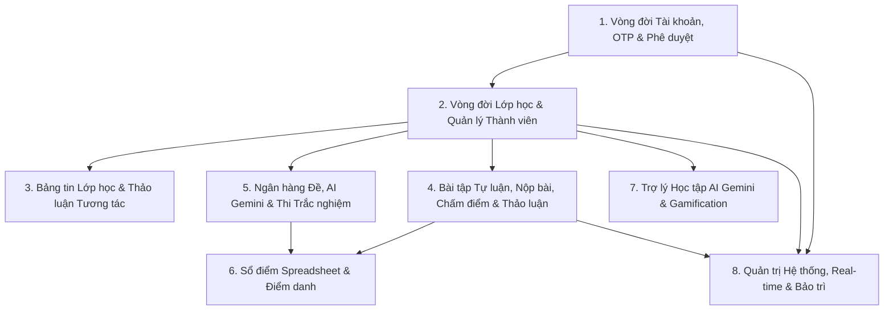

<!--
============================================================================
TÊN TÀI LIỆU: END_TO_END_TESTING_GUIDE.md
ĐƯỜNG DẪN: docs/END_TO_END_TESTING_GUIDE.md
MỤC ĐÍCH:
  Bộ Kịch Bản Kiểm Thử Toàn Diện Luồng Nghiệp Vụ Liên Thông Xuyên Suốt (End-to-End Cross-Role Testing Guide).
  Không phân chia riêng rẽ theo Role, mà cấu trúc theo Vòng Đời Tính Năng (Feature Lifecycle) - nơi nhiều Role tương tác chéo với nhau.
============================================================================
-->

# BỘ KỊCH BẢN KIỂM THỬ LIÊN THÔNG TOÀN DIỆN HỆ THỐNG (END-TO-END CROSS-ROLE TESTING GUIDE)

> **Mục đích:** Kịch bản này được thiết kế theo tư duy **Nghiệp vụ Xuyên suốt (Feature-Centric / Business Lifecycle)**. Thay vì kiểm thử rời rạc từng Role riêng lẻ, tài liệu này tập trung vào các **luồng tương tác chéo (Cross-Role Collaboration)** giữa **Admin (Quản trị viên) - Teacher (Giáo viên) - Student (Học sinh)** trên cùng một tính năng từ lúc khởi tạo đến khi kết thúc.

---

## 📌 BẢNG THÔNG TIN TÀI KHOẢN PHỐI HỢP KIỂM THỬ (TEST ACCOUNTS)

| Vai trò (Role) | Email Đăng Nhập | Mật Khẩu | Màn Hình Chính | Vai Trò Trong Kịch Bản Liên Thông |
| :--- | :--- | :--- | :--- | :--- |
| **Quản trị viên (Admin)** | `admin@gmail.com` | `admin123` | `/admin/dashboard` | Phê duyệt Giáo viên, Khóa/Mở khóa lớp, Bật/Tắt bảo trì, Giám sát hệ thống. |
| **Giáo viên (Teacher)** | `teacher@gmail.com` | `123456` *(hoặc `teacher123`)* | `/classrooms` | Tạo lớp, Duyệt học sinh, Đăng bài, Giao bài tập/đề thi, Chấm điểm, Sổ điểm, Điểm danh. |
| **Học sinh (Student)** | `student@gmail.com` | `123456` | `/dashboard` hoặc `/classrooms` | Xin vào lớp, Tải tài liệu, Bình luận, Nộp bài tự luận, Thi trắc nghiệm, Chat AI, Xem điểm. |

---

## 🗺️ MA TRẬN 8 LUỒNG NGHIỆP VỤ LIÊN THÔNG XUYÊN SUỐT (E2E FLOW MATRIX)



---

## 🛠️ CHI TIẾT 8 KỊCH BẢN KIỂM THỬ LIÊN THÔNG (E2E TEST SCENARIOS)

---

### KỊCH BẢN 1: VÒNG ĐỜI TÀI KHOẢN, XÁC THỰC OTP & PHÊ DUYỆT BỞI ADMIN (ACCOUNT LIFECYCLE & APPROVAL FLOW)

> **Mục tiêu:** Kiểm tra luồng từ khi người dùng đăng ký tài khoản (Học sinh vs Giáo viên), xác thực Email qua OTP 6 số, thông báo đẩy lên Admin, Admin duyệt/khóa tài khoản, và bảo mật phân quyền RBAC.

| Mã Kịch Bản | Luồng Nghiệp Vụ (Cross-Role Steps) | Vai Trò Thực Hiện | Hành Động & Dữ Liệu | Kết Quả Mong Đợi (Expected Outcome) | Trạng Thái |
| :---: | :--- | :---: | :--- | :--- | :---: |
| **E2E-01.1** | **Đăng ký Học sinh -> Nhập OTP -> Kích hoạt ngay** | **Student** | 1. Vào `/register`, chọn vai trò "Học sinh".<br>2. Nhập Email mới & Mật khẩu mạnh.<br>3. Bấm Đăng ký -> Nhận OTP 6 số.<br>4. Nhập 6 số vào Modal OTP 6 ô. | - Modal OTP 6 ô tự nhảy trỏ, dán Ctrl+V mượt.<br>- Kích hoạt `Active` ngay lập tức.<br>- Đăng nhập được ngay mà không cần Admin duyệt. | `[ ] Pass`<br>`[ ] Fail` |
| **E2E-01.2** | **Đăng ký Giáo viên -> Nhập OTP -> Trạng thái Chờ duyệt** | **Teacher** | 1. Vào `/register`, chọn "Giáo viên".<br>2. Nhập Email mới & Mật khẩu.<br>3. Nhập OTP 6 số kích hoạt Email. | - Xác thực Email thành công.<br>- Tài khoản ở trạng thái `Pending` (Chờ duyệt).<br>- Giáo viên chưa thể đăng nhập tạo lớp. | `[ ] Pass`<br>`[ ] Fail` |
| **E2E-01.3** | **Admin nhận thông báo Real-time & Duyệt Giáo viên** | **Admin** | 1. Mở `/admin/dashboard`.<br>2. Kiểm tra Quả Chuông Header & Hoạt động gần đây.<br>3. Vào `/admin/users`, kiểm tra Giáo viên mới ở **TOP 1 TRANG 1**.<br>4. Click xem Modal Hồ sơ chi tiết.<br>5. Bấm nút "Phê duyệt" (`Approve`). | - Quả chuông Admin nảy chấm đỏ thông báo có Giáo viên mới đăng ký.<br>- Giáo viên chuyển từ `Pending` sang `Active`.<br>- Giáo viên nhận thông báo và có thể đăng nhập vào hệ thống. | `[ ] Pass`<br>`[ ] Fail` |
| **E2E-01.4** | **Admin Khóa tài khoản -> Chặn đăng nhập -> Mở khóa** | **Admin** ➔ **Teacher** | 1. Admin bấm Khóa 1 tài khoản Giáo viên.<br>2. Giáo viên đó thử đăng nhập tại `/login`.<br>3. Admin bấm Mở khóa lại tài khoản.<br>4. Giáo viên đăng nhập lại. | - Khi bị khóa: Báo lỗi *"Tài khoản của bạn đã bị khóa bởi Quản trị viên"*, không cấp Token.<br>- Khi mở khóa: Đăng nhập thành công bình thường. | `[ ] Pass`<br>`[ ] Fail` |
| **E2E-01.5** | **Bảo mật Phân quyền RBAC chéo giữa các vai trò** | **Student** / **Teacher** / **Guest** | 1. Học sinh gõ URL `/admin/dashboard` hoặc `/bank`.<br>2. Giáo viên gõ URL `/admin/users`.<br>3. Khách chưa đăng nhập vào `/classrooms`. | - Hệ thống tự động phát hiện trái quyền.<br>- Chặn đứng truy cập và chuyển hướng về trang phù hợp kèm Toast cảnh báo. | `[ ] Pass`<br>`[ ] Fail` |

---

### KỊCH BẢN 2: VÒNG ĐỜI LỚP HỌC & QUẢN LÝ THÀNH VIÊN LIÊN THÔNG (CLASSROOM COLLABORATION LIFECYCLE)

> **Mục tiêu:** Kiểm tra trọn vẹn vòng đời lớp học: Giáo viên tạo lớp -> Học sinh gửi yêu cầu vào lớp -> Giáo viên phê duyệt / thêm trực tiếp bằng email -> Giáo viên đóng/mở lớp -> Admin can thiệp khóa/mở khóa lớp với Socket.io Real-time.

| Mã Kịch Bản | Luồng Nghiệp Vụ (Cross-Role Steps) | Vai Trò Thực Hiện | Hành Động & Dữ Liệu | Kết Quả Mong Đợi (Expected Outcome) | Trạng Thái |
| :---: | :--- | :---: | :--- | :--- | :---: |
| **E2E-02.1** | **Ràng buộc Hồ sơ & Giáo viên tạo Lớp học mới** | **Teacher** | 1. Giáo viên chưa điền đủ hồ sơ bấm Tạo lớp -> Kiểm tra chặn.<br>2. Cập nhật đủ hồ sơ -> Bấm Tạo lớp.<br>3. Nhập Tên lớp, Chủ đề màu sắc. | - Chặn tạo lớp nếu chưa hoàn thiện hồ sơ cá nhân.<br>- Khi tạo thành công: Lớp hiển thị trên Dashboard, tự động sinh mã mời duy nhất `classCode`. | `[ ] Pass`<br>`[ ] Fail` |
| **E2E-02.2** | **Học sinh nhập mã `classCode` xin vào lớp** | **Student** | 1. Học sinh đăng nhập `/dashboard`.<br>2. Bấm "Tham gia lớp học".<br>3. Nhập mã `classCode` vừa tạo ở bước 2.1. | - Toast *"Gửi yêu cầu tham gia lớp thành công!"*.<br>- Trạng thái của Học sinh trong lớp là `Pending` (Chờ duyệt). | `[ ] Pass`<br>`[ ] Fail` |
| **E2E-02.3** | **Giáo viên nhận thông báo & Phê duyệt Học sinh** | **Teacher** | 1. Giáo viên mở `/classrooms/:id/students`.<br>2. Thấy danh sách yêu cầu chờ duyệt.<br>3. Thử nghiệm Duyệt 1 học sinh / Duyệt tất cả (`Approve All`) / Từ chối 1 học sinh. | - Học sinh được duyệt chuyển thành viên chính thức (`Active`).<br>- Học sinh mở lại giao diện thấy lớp xuất hiện trên Dashboard và vào học bình thường. | `[ ] Pass`<br>`[ ] Fail` |
| **E2E-02.4** | **Giáo viên Thêm trực tiếp Học sinh bằng Email & Mời ra khỏi lớp** | **Teacher** ➔ **Student** | 1. Giáo viên bấm "Thêm học sinh" -> Gõ email học sinh.<br>2. Thử nghiệm nhập email không tồn tại / email đã có trong lớp.<br>3. Giáo viên bấm icon Thùng rác mời 1 học sinh ra khỏi lớp. | - Email hợp lệ: Học sinh được vào lớp ngay lập tức không cần duyệt.<br>- Email sai/trùng: Báo lỗi chính xác.<br>- Mời ra khỏi lớp: Học sinh mất quyền truy cập vào lớp đó. | `[ ] Pass`<br>`[ ] Fail` |
| **E2E-02.5** | **Giáo viên Đóng lớp (`Closed`) & Mở lại lớp** | **Teacher** ➔ **Student** | 1. Giáo viên chọn "Đóng lớp".<br>2. Học sinh & Giáo viên click vào thẻ lớp trên Dashboard.<br>3. Giáo viên bấm "Mở lại lớp". | - Khi Đóng lớp: Thẻ lớp mờ đi (`opacity: 0.6`), nhấp vào báo *"Lớp học đã bị đóng, không thể truy cập"*.<br>- Khi Mở lại: Trở lại hoạt động bình thường. | `[ ] Pass`<br>`[ ] Fail` |
| **E2E-02.6** | **Admin Khóa lớp (`Locked`) -> Socket Real-time nảy chuông Giáo viên & Mở khóa** | **Admin** ➔ **Teacher** ➔ **Student** | 1. Admin vào `/admin/classrooms` -> Bấm Khóa lớp vi phạm.<br>2. Quan sát màn hình Giáo viên & Học sinh.<br>3. Admin bấm Mở khóa lớp. | - **Socket.io Real-time**: Chuông thông báo Giáo viên nảy chấm đỏ báo *"Lớp học [Tên lớp] đã bị khóa bởi Quản trị viên"*, Dashboard tự cập nhật thẻ lớp bị khóa.<br>- Học sinh click thẻ lớp bị chặn truy cập.<br>- Admin mở khóa: Cả hai truy cập lại bình thường. | `[ ] Pass`<br>`[ ] Fail` |

---

### KỊCH BẢN 3: BẢNG TIN LỚP HỌC & THẢO LUẬN TƯƠNG TÁC (CLASS STREAM & DISCUSSIONS)

> **Mục tiêu:** Giáo viên đăng bài thông báo đính kèm tài nguyên đa phương tiện (PDF, Word, Link Youtube), Học sinh xem/tải tài liệu, hai bên bình luận trao đổi công khai và quản trị bình luận.

| Mã Kịch Bản | Luồng Nghiệp Vụ (Cross-Role Steps) | Vai Trò Thực Hiện | Hành Động & Dữ Liệu | Kết Quả Mong Đợi (Expected Outcome) | Trạng Thái |
| :---: | :--- | :---: | :--- | :--- | :---: |
| **E2E-03.1** | **Giáo viên đăng thông báo kèm tài liệu & Link Video** | **Teacher** | 1. Vào không gian lớp `/classrooms/:id`.<br>2. Nhập nội dung bảng tin.<br>3. Đính kèm file PDF/Word và paste link Youtube.<br>4. Bấm "Đăng bài". | - Bài đăng xuất hiện ngay trên Bảng tin.<br>- File đính kèm và Video Youtube nhúng hiển thị trực quan. | `[ ] Pass`<br>`[ ] Fail` |
| **E2E-03.2** | **Học sinh xem bài viết, tải tài liệu & Xem video** | **Student** | 1. Học sinh mở `/classrooms/:id`.<br>2. Đọc nội dung thông báo.<br>3. Click tải file tài liệu đính kèm.<br>4. Bấm phát video Youtube trực tiếp trên bảng tin. | - Nội dung hiển thị đồng bộ tức thì.<br>- File tải về thành công nguyên vẹn.<br>- Video phát mượt mà không lỗi nhúng. | `[ ] Pass`<br>`[ ] Fail` |
| **E2E-03.3** | **Trao đổi Bình luận hai chiều (Comments) & Giáo viên xóa bình luận** | **Student** ➔ **Teacher** | 1. Học sinh gửi bình luận hỏi bài dưới thông báo.<br>2. Giáo viên xem và gửi bình luận phản hồi.<br>3. Giáo viên bấm icon Xóa bình luận không phù hợp. | - Bình luận hiển thị ngay lập tức kèm Avatar, Họ tên và thời gian.<br>- Giáo viên có quyền xóa bình luận vi phạm khỏi bài đăng. | `[ ] Pass`<br>`[ ] Fail` |

---

### KỊCH BẢN 4: BÀI TẬP TỰ LUẬN, NỘP BÀI, CHẤM ĐIỂM & THẢO LUẬN BÀI NỘP (ASSIGNMENTS & GRADING LIFECYCLE)

> **Mục tiêu:** Luồng đầy đủ: Giáo viên giao bài tập tự luận -> Học sinh nộp bài với nút máy bay `<AnimatedSendButton>` -> Giáo viên chấm điểm, ghi lời phê -> Thảo luận riêng trong bài nộp -> Đồng bộ điểm về Sổ điểm.

| Mã Kịch Bản | Luồng Nghiệp Vụ (Cross-Role Steps) | Vai Trò Thực Hiện | Hành Động & Dữ Liệu | Kết Quả Mong Đợi (Expected Outcome) | Trạng Thái |
| :---: | :--- | :---: | :--- | :--- | :---: |
| **E2E-04.1** | **Giáo viên Giao bài tập tự luận (Có hạn nộp & File đính kèm)** | **Teacher** | 1. Vào tab "Bài tập", bấm "Tạo bài tập".<br>2. Nhập Tiêu đề, Hướng dẫn, Thang điểm (10), Hệ số.<br>3. Đặt Hạn nộp (Deadline tương lai).<br>4. Đính kèm tài liệu đề bài.<br>5. Bấm "Giao bài". | - Bài tập được lưu vào cơ sở dữ liệu.<br>- Phát sự kiện thông báo chuông và socket update tới tất cả Học sinh trong lớp. | `[ ] Pass`<br>`[ ] Fail` |
| **E2E-04.2** | **Học sinh nhận chuông -> Mở bài tập -> Tải file đề** | **Student** | 1. Quan sát Quả chuông trên Header của Học sinh.<br>2. Click thông báo bài tập mới.<br>3. Xem nội dung yêu cầu & tải file đính kèm. | - Chuông nảy chấm đỏ thông báo bài tập mới.<br>- Click mở thẳng vào trang chi tiết bài tập.<br>- Tải tài liệu hướng dẫn thành công. | `[ ] Pass`<br>`[ ] Fail` |
| **E2E-04.3** | **Học sinh Nộp bài tập với nút máy bay `<AnimatedSendButton>`** | **Student** | 1. Nhập nội dung bài làm text.<br>2. Đính kèm file bài làm (PDF/Word/Ảnh).<br>3. Click nút máy bay bay lượn `<AnimatedSendButton>`. | - Nút hiển thị hiệu ứng máy bay gửi bài mượt mà.<br>- Trạng thái chuyển sang "Đã nộp", ghi nhận mốc thời gian nộp (Đúng hạn hoặc Trễ hạn). | `[ ] Pass`<br>`[ ] Fail` |
| **E2E-04.4** | **Giáo viên nhận thông báo -> Mở bài nộp -> Nhập Điểm & Lời phê** | **Teacher** | 1. Chuông Giáo viên nảy thông báo Học sinh vừa nộp bài.<br>2. Mở danh sách bài nộp -> Click vào bài nộp của Học sinh.<br>3. Nhập Điểm số (8.5) và ghi Lời phê chi tiết.<br>4. Bấm "Lưu điểm". | - Điểm và Lời phê được lưu thành công.<br>- Thử nghiệm chặn nhập điểm âm (< 0) hoặc vượt thang điểm (> 10).<br>- Tự động gửi thông báo kết quả chấm tới Học sinh. | `[ ] Pass`<br>`[ ] Fail` |
| **E2E-04.5** | **Khung Thảo luận riêng trong bài nộp (Private Discussion)** | **Teacher** ⇄ **Student** | 1. Giáo viên gõ tin nhắn trong khung Thảo luận bài nộp.<br>2. Học sinh nhận thông báo, mở ra xem và phản hồi lại.<br>3. Cả hai theo dõi cuộc hội thoại trực tiếp. | - Tin nhắn trao đổi hiển thị chuẩn thời gian thực.<br>- Giữ bảo mật riêng tư giữa Giáo viên và Học sinh đó. | `[ ] Pass`<br>`[ ] Fail` |
| **E2E-04.6** | **Đồng bộ Điểm sang Sổ điểm & Dashboard Học sinh** | **Student** & **Teacher** | 1. Học sinh kiểm tra mục Điểm số & Dashboard.<br>2. Giáo viên mở Sổ điểm `/gradebook`. | - Điểm 8.5 hiển thị chuẩn xác tại ô điểm của Học sinh trên cả Sổ điểm Giáo viên và Dashboard Học sinh. | `[ ] Pass`<br>`[ ] Fail` |

---

### KỊCH BẢN 5: NGÂN HÀNG ĐỀ, AI GEMINI & THI TRẮC NGHIỆM TRỰC TUYẾN (QUIZ BANK, AI & ONLINE EXAM)

> **Mục tiêu:** Tạo đề thi từ Ngân hàng đề (Thủ công / Excel / Word / AI Gemini) -> Giao bài thi trắc nghiệm đếm ngược -> Học sinh làm bài -> Hệ thống tự động chấm điểm 100% tức thì -> Tự động nhảy điểm vào Sổ điểm.

| Mã Kịch Bản | Luồng Nghiệp Vụ (Cross-Role Steps) | Vai Trò Thực Hiện | Hành Động & Dữ Liệu | Kết Quả Mong Đợi (Expected Outcome) | Trạng Thái |
| :---: | :--- | :---: | :--- | :--- | :---: |
| **E2E-05.1** | **Bóc tách Đề thi tự động bằng AI Gemini hoặc File Word/Excel** | **Teacher** / **Admin** | 1. Mở `/bank` -> Bấm "Tạo đề thi mới".<br>2. Chọn Nhập từ file Word hoặc Excel.<br>3. Dùng chức năng bóc tách AI Gemini (`gemini-2.5-flash`).<br>4. Bấm nút "Tự động chia đều điểm số" (`Auto Divide`). | - Đề thi trắc nghiệm gồm đầy đủ câu hỏi, 4 phương án A/B/C/D và đáp án đúng.<br>- Điểm số được chia đều chuẩn xác (ví dụ 10 câu = 1.0 điểm/câu). | `[ ] Pass`<br>`[ ] Fail` |
| **E2E-05.2** | **Giáo viên Giao đề thi trắc nghiệm cho Lớp học** | **Teacher** | 1. Từ kho đề thi, bấm "Giao bài".<br>2. Chọn Lớp học áp dụng.<br>3. Cài đặt Thời gian làm bài (ví dụ: 15 phút), Hạn chót.<br>4. Bấm "Xác nhận giao". | - Đề thi trắc nghiệm được liên kết vào lớp học.<br>- Học sinh trong lớp nhận thông báo bài thi mới. | `[ ] Pass`<br>`[ ] Fail` |
| **E2E-05.3** | **Học sinh Vào phòng thi -> Làm bài thi có Đồng hồ đếm ngược** | **Student** | 1. Học sinh mở bài thi trắc nghiệm.<br>2. Bấm "Bắt đầu làm bài".<br>3. Quan sát Đồng hồ đếm ngược chạy giật từng giây.<br>4. Chọn đáp án từng câu hỏi, điều hướng Next/Prev/Dot Indicator. | - Giao diện thi toàn màn hình tập trung.<br>- Đồng hồ đếm ngược hiển thị chính xác.<br>- Lưu tạm đáp án đã chọn theo thời gian thực (không mất khi reload). | `[ ] Pass`<br>`[ ] Fail` |
| **E2E-05.4** | **Nộp bài thi & Hệ thống Tự động Chấm điểm 100% Tức thì** | **Student** | 1. Chọn xong các câu hỏi, bấm "Nộp bài thi" (có Modal xác nhận cảnh báo số câu chưa làm).<br>2. Bấm "Xác nhận nộp". | - Hệ thống **tự động chấm điểm 100% ngay lập tức**.<br>- Hiển thị kết quả điểm số, số câu đúng/sai, thời gian hoàn thành.<br>- Xem giải thích chi tiết từng câu hỏi. | `[ ] Pass`<br>`[ ] Fail` |
| **E2E-05.5** | **Tự động Ghi nhận Điểm trắc nghiệm vào Sổ điểm Giáo viên** | **Teacher** | 1. Giáo viên mở `/gradebook`.<br>2. Kiểm tra cột điểm của bài thi trắc nghiệm vừa nộp. | - Điểm số của Học sinh tự động hiển thị trong ô điểm tương ứng mà Giáo viên không cần nhập thủ công. | `[ ] Pass`<br>`[ ] Fail` |

---

### KỊCH BẢN 6: SỔ ĐIỂM SPREADSHEET, ĐIỂM DANH & TÍNH ĐTB TỰ ĐỘNG (GRADEBOOK & ATTENDANCE FLOW)

> **Mục tiêu:** Kiểm tra lưới Sổ điểm bảng tính ma trận chuẩn format 4 số `XX.XX`, tự động ghi nhận `00.00` và viền đỏ khi quá hạn, công thức tính Điểm Trung Bình môn (ĐTB) theo trọng số và hệ thống Điểm danh chuyên cần.

| Mã Kịch Bản | Luồng Nghiệp Vụ (Cross-Role Steps) | Vai Trò Thực Hiện | Hành Động & Dữ Liệu | Kết Quả Mong Đợi (Expected Outcome) | Trạng Thái |
| :---: | :--- | :---: | :--- | :--- | :---: |
| **E2E-06.1** | **Giáo viên Điểm danh chuyên cần & Thống kê cá nhân của Học sinh** | **Teacher** ➔ **Student** | 1. Giáo viên vào `/attendance`, chọn ngày.<br>2. Tích chọn trạng thái: Có mặt, Đi muộn, Có phép, Vắng.<br>3. Nhập ghi chú lý do vắng -> Bấm Lưu.<br>4. Học sinh mở mục Điểm danh cá nhân. | - Lưu dữ liệu điểm danh thành công.<br>- Học sinh xem được thống kê tỷ lệ chuyên cần cá nhân và lý do ghi chú của giáo viên. | `[ ] Pass`<br>`[ ] Fail` |
| **E2E-06.2** | **Lưới Sổ điểm Spreadsheet & Nhập/sửa trực tiếp chuẩn `XX.XX`** | **Teacher** | 1. Mở `/gradebook`.<br>2. Click trực tiếp vào một ô điểm.<br>3. Gõ điểm số mới (ví dụ: `09.50` hoặc `10.00`).<br>4. Nhấn Enter hoặc click ra ngoài. | - Ô điểm lưu thành công giá trị mới.<br>- Chuẩn định dạng 4 ký tự số (`XX.XX`).<br>- Chặn nhập số âm, ký tự chữ hoặc số lớn hơn 10. | `[ ] Pass`<br>`[ ] Fail` |
| **E2E-06.3** | **Tự động ghi nhận `00.00` & Viền đỏ khi Quá hạn bài tập** | **Teacher** & **Student** | 1. Quan sát bài tập đã quá Deadline mà Học sinh chưa nộp.<br>2. Kiểm tra ô điểm tương ứng trên Sổ điểm. | - Tự động ghi nhận `00.00` điểm.<br>- Viền đỏ cảnh báo nổi bật thể hiện tình trạng quá hạn chưa nộp. | `[ ] Pass`<br>`[ ] Fail` |
| **E2E-06.4** | **Tự động tính Điểm Trung Bình môn (ĐTB) theo hệ số trọng số** | **Teacher** & **Student** | 1. Kiểm tra cột "Điểm trung bình (ĐTB)" ở cuối bảng điểm.<br>2. Thay đổi điểm của một bài tập có hệ số khác nhau (hệ số 1, hệ số 2). | - Công thức tính toán chuẩn xác theo trọng số: `ĐTB = Tổng(Điểm x Hệ số) / Tổng Hệ số`.<br>- Tự động làm tròn 2 chữ số thập phân.<br>- Đồng bộ trên màn hình xem điểm của Học sinh. | `[ ] Pass`<br>`[ ] Fail` |

---

### KỊCH BẢN 7: TRỢ LÝ AI GEMINI, PHÂN TÍCH LỖ HỔNG & HỆ THỐNG GAMIFICATION (AI TUTOR & GAMIFICATION)

> **Mục tiêu:** Học sinh tương tác với Trợ lý AI Gemini thông minh, hệ thống tự động phát hiện lỗ hổng kiến thức từ bài thi trắc nghiệm để ôn tập, tích lũy điểm kinh nghiệm (XP), Streak, Level và Bảng xếp hạng thi đua.

| Mã Kịch Bản | Luồng Nghiệp Vụ (Cross-Role Steps) | Vai Trò Thực Hiện | Hành Động & Dữ Liệu | Kết Quả Mong Đợi (Expected Outcome) | Trạng Thái |
| :---: | :--- | :---: | :--- | :--- | :---: |
| **E2E-07.1** | **Trò chuyện & Giải đáp thắc mắc với Trợ lý AI Gemini** | **Student** | 1. Mở `/chat` hoặc Widget Trợ lý AI.<br>2. Nhập câu hỏi bài học (Toán, Văn, Anh, Lập trình...).<br>3. Bấm Gửi. | - AI Gemini trả lời thông minh, đúng trọng tâm, định dạng Markdown rõ ràng.<br>- Hỗ trợ công thức toán học và giải thích từng bước. | `[ ] Pass`<br>`[ ] Fail` |
| **E2E-07.2** | **Tự động Phân tích Lỗ hổng Kiến thức & Đề xuất Ôn tập** | **Student** | 1. Sau khi làm bài thi trắc nghiệm (có một số câu sai).<br>2. Mở mục "Phân tích Lỗ hổng Kiến thức" / Đề xuất ôn tập. | - Hệ thống gắn tag các chủ đề có câu trả lời sai.<br>- Đưa ra khuyến nghị ôn tập và bài tập luyện tập bổ trợ cho chủ đề yếu đó. | `[ ] Pass`<br>`[ ] Fail` |
| **E2E-07.3** | **Tích lũy XP, Level, Chuỗi Streak & Bảng Xếp Hạng (Leaderboard)** | **Student** | 1. Học sinh nộp bài tập / làm bài thi trắc nghiệm.<br>2. Quan sát hiệu ứng cộng XP, lên Level, cập nhật chuỗi Streak ngày học.<br>3. Mở Bảng xếp hạng (Leaderboard) lớp/hệ thống. | - Tích lũy XP chuẩn xác, hiển thị thanh tiến trình Level.<br>- Tên và Avatar của Học sinh được cập nhật thứ hạng chính xác trên Leaderboard. | `[ ] Pass`<br>`[ ] Fail` |

---

### KỊCH BẢN 8: BẢNG ĐIỀU KHIỂN QUẢN TRỊ, GIÁM SÁT REAL-TIME & CHẾ ĐỘ BẢO TRÌ (ADMIN DASHBOARD & SYSTEM MONITORING)

> **Mục tiêu:** Admin giám sát toàn hệ thống, xuất báo cáo CSV tiếng Việt, kích hoạt Chế độ Bảo trì chặn toàn bộ Giáo viên và Học sinh, hệ thống Quả Chuông Real-time đa chiều.

| Mã Kịch Bản | Luồng Nghiệp Vụ (Cross-Role Steps) | Vai Trò Thực Hiện | Hành Động & Dữ Liệu | Kết Quả Mong Đợi (Expected Outcome) | Trạng Thái |
| :---: | :--- | :---: | :--- | :--- | :---: |
| **E2E-08.1** | **Admin Dashboard: 4 Widgets thống kê, Biểu đồ Cột & Xuất Báo Cáo CSV** | **Admin** | 1. Mở `/admin/dashboard`.<br>2. Kiểm tra số liệu 4 Thẻ thống kê & Biểu đồ cột 12 tháng.<br>3. Bấm nút "Xuất báo cáo CSV". | - Số liệu thống kê chuẩn xác, thời gian thực.<br>- File CSV tải về định dạng UTF-8 BOM, mở bằng Excel tiếng Việt không lỗi font. | `[ ] Pass`<br>`[ ] Fail` |
| **E2E-08.2** | **Bật Chế độ Bảo trì (`Maintenance Mode`) -> Chặn toàn bộ Giáo viên & Học sinh** | **Admin** ➔ **Teacher** & **Student** | 1. Admin vào `/admin/settings` -> Bật công tắc "Chế độ Bảo trì".<br>2. Giáo viên và Học sinh thực hiện thao tác bất kỳ hoặc truy cập URL. | - Toàn bộ Học sinh và Giáo viên ngay lập tức bị chặn truy cập và chuyển hướng về Màn hình Thông báo Bảo trì hệ thống.<br>- Tài khoản Admin vẫn truy cập quản trị bình thường. | `[ ] Pass`<br>`[ ] Fail` |
| **E2E-08.3** | **Tắt Chế độ Bảo trì -> Phục hồi hoạt động bình thường** | **Admin** ➔ **Teacher** & **Student** | 1. Admin vào `/admin/settings` -> Tắt công tắc "Chế độ Bảo trì".<br>2. Giáo viên và Học sinh reload hoặc truy cập lại. | - Màn hình bảo trì biến mất.<br>- Hệ thống phục hồi hoạt động bình thường cho mọi người dùng. | `[ ] Pass`<br>`[ ] Fail` |
| **E2E-08.4** | **Kiểm tra Quả Chuông Thông Báo Real-time Đa Chiều Toàn Hệ Thống** | **Admin** ⇄ **Teacher** ⇄ **Student** | 1. Kiểm tra chuông báo khi Admin duyệt/khóa lớp.<br>2. Kiểm tra chuông báo khi Giáo viên giao bài / chấm điểm.<br>3. Kiểm tra chuông báo khi Học sinh nộp bài.<br>4. Click đọc thông báo -> Kiểm tra chuyển trạng thái và biến mất chấm đỏ. | - Quả chuông trên Header của cả 3 vai trò hoạt động đồng bộ, tức thời qua Socket.io.<br>- Không cần reload trang vẫn nảy chấm đỏ và popup thông báo.<br>- Đánh dấu đã đọc mượt mà. | `[ ] Pass`<br>`[ ] Fail` |

---

## 🎯 HƯỚNG DẪN QUY TRÌNH REVIEW & TEST THỰC TẾ (HOW TO TEST)

Bạn có thể tiến hành test và nghiệm thu toàn bộ hệ thống theo 2 cách cực kỳ thuận tiện:

### Cách 1: Chạy Tự Động Hóa Qua Bộ Test Scripts Có Sẵn (Automated Regression)
Chỉ cần mở terminal tại thư mục `backend-classroom` và chạy lần lượt các script kiểm thử tự động đã được lập trình sẵn:
```bash
# 1. Bộ kiểm thử toàn diện Quản trị viên (Admin - 76 test cases)
node src/scripts/test_admin_module1.js
node src/scripts/test_admin_module2.js
node src/scripts/test_admin_module3.js
node src/scripts/test_admin_module4.js
node src/scripts/test_admin_module5.js
node src/scripts/test_admin_module6.js
node src/scripts/test_admin_module7.js

# 2. Bộ kiểm thử toàn diện Giáo viên (Teacher - 123 test cases)
node src/scripts/test_teacher_module1.js
node src/scripts/test_teacher_module2.js
node src/scripts/test_teacher_module3.js
node src/scripts/test_teacher_module4.js
node src/scripts/test_teacher_module5.js
node src/scripts/test_teacher_module6.js
node src/scripts/test_teacher_module7.js
node src/scripts/test_teacher_module8.js
```

### Cách 2: Test Thủ Công Trực Tiếp Trên Trình Duyệt (Manual Cross-Browser Testing)
1. Mở 2 hoặc 3 cửa sổ trình duyệt (hoặc 1 cửa sổ thường + 1 cửa sổ Ẩn danh Incognito):
   - **Cửa sổ 1:** Đăng nhập `teacher@gmail.com` / `123456`.
   - **Cửa sổ 2:** Đăng nhập `student@gmail.com` / `123456`.
   - **Cửa sổ 3 (hoặc luân phiên):** Đăng nhập `admin@gmail.com` / `admin123`.
2. Thực hiện theo trình tự từ **Kịch bản 1 đến Kịch bản 8** ở trên:
   - Giáo viên thao tác -> Quan sát Học sinh nhận thông báo và làm bài.
   - Học sinh nộp bài -> Quan sát Giáo viên nhận chuông và chấm điểm.
   - Admin khóa lớp / bật bảo trì -> Quan sát tác động tức thì lên cả Giáo viên và Học sinh.
3. Đánh dấu `[x] Pass` vào bảng bên trên sau mỗi ca kiểm thử hoàn tất thành công.
