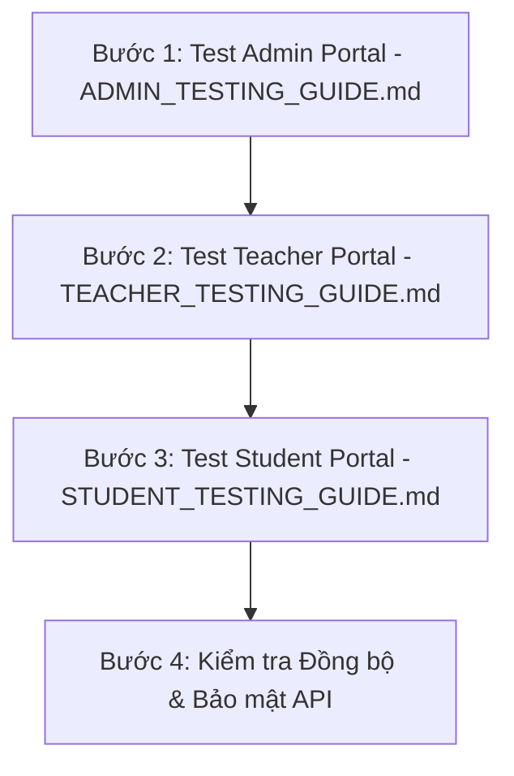

# TÀI LIỆU TỔNG HỢP TOÀN BỘ CHỨC NĂNG & KỊCH BẢN KIỂM THỬ HỆ THỐNG (LMS CLASSROOM)

> **Mục đích:** Tài liệu này thống nhất toàn bộ các đặc tả chức năng, quy định phân quyền (RBAC), logic nghiệp vụ, danh sách REST API và kịch bản kiểm thử (Test Checklist) của hệ thống Quản lý Lớp học (ClassRoom). Sử dụng làm căn cứ cho bước kiểm thử sản phẩm cuối cùng (Final Product Testing).

---

## I. TỔNG QUAN HỆ THỐNG & TÀI KHOẢN THỬ NGHIỆM DEMO (DEMO ACCOUNTS)

📌 **Tài liệu Chi tiết Hướng dẫn Trải nghiệm Tài khoản Demo**: [DEMO_ACCOUNTS.md](file:///d:/HTML-CSS-JS/ClassRoom/docs/DEMO_ACCOUNTS.md)

Hệ thống Quản lý Học tập (LMS ClassRoom) phân chia thành 3 vai trò chính. Nhà tuyển dụng / Người đánh giá có thể **dùng ngay các tài khoản thử nghiệm tạo sẵn dưới đây** mà không cần tốn thời gian đăng ký:

| Vai trò (Role) | Email đăng nhập | Mật khẩu (Password) | Đường dẫn chính | Phạm vi tác động & Mô tả |
| :--- | :--- | :--- | :--- | :--- |
| **Quản trị viên (Admin)** | `admin@gmail.com` | `admin123` | `/admin/dashboard` | **System-wide Access**: Duyệt Giáo viên `Pending` ở TOP 1, Khóa/Mở khóa tài khoản & Lớp học, Bật bảo trì, Xuất báo cáo CSV. |
| **Giáo viên (Teacher)** | `teacher@gmail.com` | `teacher123` *(hoặc `123456`)* | `/classrooms` | **Class-scoped Management**: Tạo lớp tự động sinh `classCode`, Đóng/mở lớp, Tạo đề thi trắc nghiệm AI Gemini từ file Word `.docx`, Chấm bài, Sổ điểm Spreadsheet, Nhận thông báo Real-time từ Admin. |
| **Học sinh (Student)** | `student@gmail.com` | `123456` | `/dashboard` | **User-scoped Learning**: Nhập `classCode` xin vào lớp, Nộp bài tập tự luận với nút máy bay `<AnimatedSendButton>`, Làm thi trắc nghiệm đếm ngược, Trợ lý AI Gemini (`/chat`), Tích lũy XP, Level, Leaderboard & Ôn tập lỗ hổng kiến thức. |

---

## II. MA TRẬN PHÂN QUYỀN HỆ THỐNG & LUỒNG ĐĂNG KÝ (RBAC & APPROVAL WORKFLOW)

> **Quy trình Xác thực Email (OTP) & Phê duyệt (Approval Workflow):**
> 1. **Đăng ký bằng Google OAuth 2.0:** Tự động xác thực email 100%, Học sinh kích hoạt `Active` ngay lập tức; Giáo viên chuyển trạng thái `Pending` chờ Admin duyệt.
> 2. **Đăng ký Thủ công (Manual Register):** 
>    - **Xác thực Email qua OTP:** Cả Học sinh và Giáo viên khi đăng ký thủ công đều phải nhập mã OTP 6 số gửi về Email. Giao diện xác thực gồm 6 ô nhập số độc lập (`[1][2][3]-[4][5][6]`), tự động nhảy con trỏ, tự động bôi đen ghi đè số cũ khi gõ lại, dán nhanh Ctrl+V, nút đóng X và bộ đếm ngược 30 giây để gửi lại mã.
>    - **Hỗ trợ Đăng ký lại mượt mà (Re-registration):** Nếu người dùng đăng ký dở dang nhưng tắt Modal OTP (chưa xác thực), khi thực hiện Đăng ký lại bằng Email đó, hệ thống sẽ tự động xóa bản ghi chưa xác thực cũ và phát hành mã OTP mới mà không báo lỗi trùng Email.
>    - **Tự động kích hoạt Modal OTP khi Đăng nhập:** Khi người dùng cố gắng đăng nhập tại `/login` với tài khoản chưa xác thực Email, hệ thống tự động bật Modal OTP 6 số ngay trên màn hình Đăng nhập để người dùng nhập OTP kích hoạt tại chỗ.
>    - **Ẩn tài khoản chưa xác thực khỏi Admin:** Tài khoản chưa xác thực OTP (`isEmailVerified = false`) hoàn toàn bị ẩn khỏi danh sách Quản lý người dùng và Widgets đếm của Admin cho đến khi xác thực thành công.
>    - **Luồng Học sinh:** Đăng ký -> Nhập OTP xác thực Email -> Tài khoản kích hoạt `Active` ngay lập tức (không cần Admin duyệt, có thể đăng nhập ngay). Khi nhập mã `classCode` xin vào lớp -> Trạng thái trong Lớp là `Pending` chờ Giáo viên duyệt vào lớp.
>    - **Luồng Giáo viên:** Đăng ký -> Nhập OTP xác thực Email -> Chuyển sang trạng thái `Pending` -> Hệ thống phát thông báo Real-time đẩy lên Top 1 danh sách Admin -> Admin duyệt -> Giáo viên chính thức `Active` và có quyền tạo lớp.

> **Ký hiệu:**  
> - `C` (Create): Tạo mới | `R` (Read): Xem / Tải về  
> - `U` (Update): Sửa / Cập nhật / Phân quyền | `D` (Delete): Xóa / Khóa / Vô hiệu hóa  

| Nhóm Chức Năng | Chi Tiết Nghiệp Vụ | Admin | Teacher | Student |
| :--- | :--- | :---: | :---: | :---: |
| **Xác thực & Tài khoản** | Đăng nhập / Đăng ký nhanh bằng Google OAuth 2.0 (Tự động xác thực email 100%) | **C R** | **C R** | **C R** |
| | Đăng ký thủ công + Xác thực OTP 6 số qua Email (Học sinh `Active` ngay / Giáo viên `Pending` chờ duyệt) | **C R** | **C R** | **C R** |
| | **Thông báo Real-time**: Báo Giáo viên mới chờ duyệt trên **Quả Chuông Header** & **Hoạt động gần đây** | **R U** | - | - |
| | **Tự động Ưu tiên**: Đẩy tài khoản `Pending` lên **TOP ĐẦU TRANG 1** & Nút Lọc Nhanh `⏳ Chờ duyệt (X)` | **U** | - | - |
| | **Hồ sơ Chi tiết**: Bổ sung đầy đủ 7 trường thông tin người dùng (`Avatar`, `Giới tính`, `Ngày sinh - DOB`, `SĐT/Zalo`, `Bằng cấp/Trình độ`, `Giới thiệu bản thân - Bio`, `Ngày đăng ký`) và **Modal Xem Hồ Sơ Chi Tiết** chuẩn UI spacing | **R U** | - | - |
| | Phê duyệt (Approve) tài khoản Giáo viên đăng ký mới (`Pending` -> `Active`) | **U** | - | - |
| | Cấp mới trực tiếp / Khóa / Mở khóa / Xóa tài khoản Giáo viên | **C U D** | - | - |
| | Cấp mới / Khóa / Mở khóa / Xóa tài khoản Học sinh | **C U D** | **C U D** | - |
| | Khôi phục (Reset) mật khẩu cho người dùng | **U** | **U** (Học sinh) | - |
| | Phân quyền Admin cho tài khoản khác | **U** | - | - |
| **Quản lý Lớp học** | Tạo lớp học mới (Tự động sinh mã `classCode` duy nhất; **Ràng buộc**: Yêu cầu Giáo viên hoàn thiện đầy đủ thông tin hồ sơ trước khi tạo). Lớp mới ở trạng thái `Pending` được ưu tiên xếp đập đập ở TOP ĐẦU Trang 1 chờ Admin duyệt. | - | **C** (Chỉ sau khi được duyệt & đủ hồ sơ) | - |
| | Xem danh sách lớp, sĩ số, giáo viên phụ trách (Hỗ trợ dạng Grid và Table) | **R** | **R** | **R** (Chỉ lớp đã vào) |
| | **Trạng thái Đóng lớp (Closed)**: Giáo viên đóng lớp khi kết thúc kỳ học. Thẻ lớp mờ đi (`opacity: 0.6`), chặn nhấp chuột với cả Giáo viên và Học sinh cùng thông báo *"Lớp học đã bị đóng, không thể truy cập"*. Giáo viên có thể bấm "Mở lại lớp" trên Dashboard bất cứ lúc nào. | - | **U** | - |
| | **Trạng thái Bị khóa (Locked)**: Admin khóa lớp vi phạm. Thẻ mờ đi, chặn nhấp chuột đối với cả Giáo viên và Học sinh. **Tích hợp Socket.io Real-time**: Khi Admin Khóa/Mở khóa lớp, tín hiệu tự động nảy thông báo đỏ trên **Chuông của Giáo viên** và tự động reload trạng thái lớp trên Dashboard Giáo viên tức thì. | **U D** | - | - |
| | **Trạng thái Lưu trữ (Archived)**: Giáo viên đưa lớp vào lưu trữ (Soft delete), ẩn khỏi Dashboard nhưng bảo lưu dữ liệu. | - | **U D** | - |
| | Tham gia lớp học mới bằng mã `classCode` & Duyệt học sinh vào lớp | - | **U** (Phê duyệt học sinh) | **C** (Gửi yêu cầu vào lớp) |
| **Tương tác & Bài học** | Đăng thông báo, chia sẻ tài liệu (PDF, Word, Video) | - | **C U D** | **R** |
| | Bình luận công khai (Comment) hỏi đáp trong lớp | - | **C R D** | **C R** |
| **Bài tập & Chấm điểm** | Giao bài tập về nhà, thiết lập Deadline & thang điểm | - | **C U D** | **R** |
| | Nộp bài tập (Đính kèm file PDF/Word / Nhập text) | - | - | **C U** |
| | Chấm điểm, chỉnh sửa điểm, gửi lời phê nhận xét | - | **C U D** | **R** (Chỉ xem điểm) |
| | Tự động tính Điểm trung bình môn (ĐTB) theo hệ số | - | **R** | **R** |
| **Điểm danh (Attendance)**| Tích chọn trạng thái (Có mặt / Đi muộn / Vắng mặt) | - | **C U** | - |
| | Thống kê tỷ lệ chuyên cần | - | **R** (Cả lớp) | **R** (Cá nhân) |
| **Trắc nghiệm (Quiz)** | Quản lý ngân hàng câu hỏi, tạo câu hỏi tự động bằng AI | - | **C U D** | - |
| | Làm bài thi trắc nghiệm trực tuyến (Đồng hồ đếm ngược) | - | - | **C** |
| | Tự động chấm điểm thi trắc nghiệm & đồng bộ Sổ điểm | - | **R** | **R** |
| **Báo cáo & Phân tích** | Biểu đồ phổ điểm, xu hướng chuyên cần, cảnh báo lỗ hổng AI | **R** (Hệ thống)| **R** (Lớp) | **R** (Cá nhân) |
| **Cài đặt & Bảo mật** | Bật/tắt bảo trì, cấu hình chung, múi giờ, logo | **C U** | - | - |

---

## III. CHI TIẾT CHỨC NĂNG & CHECKLIST KIỂM THỬ THEO PHÂN HỆ

---

### 1. PHÂN HỆ QUẢN TRỊ VIÊN (ADMIN PORTAL) - Đường dẫn: `/admin`

#### 1.1 Bảng điều khiển Quản trị (`/admin/dashboard` & `/admin/analytics`)
- [ ] **Thẻ Thống kê Tổng quan (4 Widgets):**
  - Hiển thị đúng số lượng Tổng Giáo viên, Tổng Học sinh, Lớp học đang hoạt động và Lượt tương tác.
  - Hiển thị phần trăm tăng trưởng (`%`) so với tháng trước.
- [ ] **Biểu đồ Tăng trưởng Người dùng (User Growth):** Hiển thị biểu đồ dạng cột (Bar Chart) thiết kế không viền, nổi bật mượt mà, so sánh chính xác lượng Giáo viên & Học sinh gia nhập hệ thống theo từng tháng.
- [ ] **Timeline Hoạt động Gần đây (Recent Activity):**
  - **Phân loại bằng Icon & Màu sắc Semantic:** Hiển thị icon riêng cho từng tác vụ chuyên môn của giáo viên (Icon Thêm Lớp - Xanh dương, Icon Bài Tập - Tím, Icon Điểm Danh - Xanh lá, Icon File/Tài liệu - Vàng, Icon Thông Báo - Đỏ).
  - **Thẻ Tên & Lớp học nổi bật:** In đậm Tên giáo viên + Highlight Tên môn/Lớp học giúp Admin đọc lướt 1 giây là hiểu ngay tác vụ.
  - **Nút Xem tất cả:** Thiết kế chuẩn `AnimatedAddButton` nằm ở chân thẻ với hiệu ứng hover mượt mà.
- [ ] **Biểu đồ Phân bổ Học sinh theo Giáo viên (Teacher Student Stats):**
  - Hiển thị danh sách các thẻ biểu đồ hình Tròn (Donut/Pie Chart) đại diện cho từng Giáo viên phụ trách môn học.
  - Hiển thị tổng số lượng Học sinh và tỷ lệ phân bổ Học sinh giữa các Lớp học do Giáo viên đó quản lý.
  - Tooltip tương tác hiển thị Tên lớp & Sĩ số khi di chuột; chân thẻ hiển thị nút tương tác "Đang quản lý X lớp học".

#### 1.2 Quản lý Người dùng (`/admin/users`)
- [ ] **Phê duyệt Giáo viên tự đăng ký mới (Luồng Phê duyệt mới):**
  - Hỗ trợ bộ lọc Trạng thái `Chờ phê duyệt` (`Pending`).
  - Nút **[ Phê duyệt ]** 1-Click trực tiếp tại hàng tài khoản Giáo viên `Pending`.
  - Khi Admin bấm **[ Phê duyệt ]**, tài khoản chuyển sang `Active` và Giáo viên đăng nhập bình thường.
- [ ] **Tạo tài khoản Giáo viên trực tiếp bởi Admin:**
  - Nút "Thêm giáo viên" mở Dialog điền Họ tên, Email, Mật khẩu khởi tạo.
  - Gọi API `POST /api/v1/auth/create-teacher` khởi tạo ngay trạng thái `Active`.
- [ ] **Tìm kiếm & Lọc nâng cao:**
  - Ô tìm kiếm lọc chính xác theo Tên hoặc Email.
  - Lọc theo Vai trò (`Admin`, `Teacher`, `Student`).
  - Lọc theo Trạng thái (`Active` - Đang hoạt động, `Pending` - Chờ phê duyệt, `Locked` - Đã khóa).
- [ ] **Khóa / Mở khóa tài khoản:**
  - Chuyển đổi trạng thái bằng API `PUT /api/v1/users/:id/status`.
  - **Kiểm thử bảo mật:** Khi tài khoản ở trạng thái `Pending` hoặc `Locked`, tài khoản đó lập tức bị chặn đăng nhập và xuất hiện thông báo lỗi phù hợp.
- [ ] **Phân quyền (Đổi quyền):**
  - Đổi quyền user bằng API `PUT /api/v1/users/:id/role`.
- [ ] **Reset Mật khẩu:**
  - Đặt lại mật khẩu mới cho người dùng qua API `PUT /api/v1/users/:id/reset-password`.
- [ ] **Xóa tài khoản:**
  - Xóa đơn lẻ hoặc xóa hàng loạt qua API `DELETE /api/v1/users/:id` có Dialog xác nhận cảnh báo.

#### 1.3 Quản lý Lớp học Hệ thống (`/admin/classrooms`)
- [ ] **Xem danh sách Lớp học Toàn hệ thống:**
  - Hiển thị thông tin: Tên lớp, Mã lớp, Giáo viên phụ trách, Bộ môn, Sĩ số, Ngày tạo, Trạng thái.
- [ ] **Quick View Panel (Xem nhanh chi tiết):**
  - Click vào 1 dòng lớp học -> Panel bên phải trượt ra hiển thị bài giảng hiện tại và timeline hoạt động gần đây của lớp đó (`GET /api/v1/classrooms/admin/:id/activities`).
- [ ] **Khóa / Mở khóa Lớp học:**
  - Khóa lớp qua API `PUT /api/v1/classrooms/:id/status`. Khi bị khóa, GV và HS trong lớp đó bị chặn truy cập và có thông báo vi phạm.
  - Phân biệt với trạng thái **Đóng lớp** của Giáo viên (chỉ là Read-only).
- [ ] **Xóa Lớp học:**
  - Xóa vĩnh viễn lớp học qua API `DELETE /api/v1/classrooms/:id`.

#### 1.4 Cài đặt Hệ thống (`/admin/settings`)
- [ ] **Cấu hình Chung:** Thay đổi tên hệ thống, múi giờ (GMT+7), định dạng ngày tháng, logo.
- [ ] **Chế độ Bảo trì (Maintenance Mode):** Khi bật công tắc bảo trì, người dùng thông thường đăng nhập sẽ thấy màn hình thông báo bảo trì, chỉ duy nhất tài khoản Admin được phép truy cập.

#### 1.5 Ngân hàng Đề & Bài tập Hệ thống (`/bank`)
- [ ] **Quyền Quản trị viên (Admin):**
  - Có quyền truy cập `/bank` để soạn bài tập/đề thi mẫu dùng chung toàn trung tâm (`sharingStatus: 'CENTER_SHARED'`).
  - Hỗ trợ toàn bộ môn học tiêu chuẩn (*Toán, Ngữ văn, Tiếng Anh, Vật lý, Hóa học, Sinh học, Lịch sử, Địa lý, Tin học, GDCD, Âm nhạc, Mỹ thuật, Thể dục*) và tính năng chọn **`+ Môn khác...`** để tự nhập môn học mới tùy chỉnh.
  - Quản lý, xem chi tiết, chỉnh sửa và xóa tài nguyên học liệu trên toàn hệ thống.

---

### 2. PHÂN HỆ GIÁO VIÊN (TEACHER PORTAL) - Đường dẫn: `/classrooms`, `/bank`

#### 2.1 Quản lý Lớp học (`/classrooms`)
- [ ] **Danh sách Lớp học:** Hiển thị dạng Grid Card đẹp mắt. Mỗi thẻ hiển thị Tên lớp, Mã lớp (`classCode`), Sĩ số, Trạng thái (Hoạt động / Đã đóng / Chờ duyệt / Bị khóa).
- [ ] **Tạo Lớp học Mới:** Nút `AnimatedAddButton` kích hoạt modal tạo lớp. Hệ thống tự động sinh `classCode` ngẫu nhiên duy nhất (ví dụ: `X8K9L2`).
- [ ] **Đóng / Mở lại Lớp học:** Giáo viên có thể đóng lớp khi kết thúc kỳ học. Học sinh chỉ có thể xem lại dữ liệu cũ, không nộp được bài mới.
- [ ] **Sao chép Mã lớp:** Nút click 1-touch copy nhanh mã lớp để gửi cho học sinh.

#### 2.2 Không gian Lớp học Chi tiết (`/classrooms/:id`)
- [ ] **Tab Bảng tin (Announcements):**
  - Giáo viên đăng bài thông báo mới, đính kèm file (PDF, Word) hoặc link Youtube/Drive.
  - Giáo viên và học sinh có thể gửi bình luận công khai bên dưới bài đăng.
- [ ] **Tab Bài tập (Assignments):**
  - **Tạo bài tập mới:** Nhập tiêu đề, mô tả, chọn hạn nộp (Deadline), chọn hệ số điểm. Nút "Giao bài ngay" dùng `AnimatedAddButton`.
  - **Chấm bài & Lời phê:** Mở danh sách bài nộp của học sinh, xem file đính kèm (PDF/Word), nhập điểm số và viết lời phê nhận xét. Nút "Lưu điểm" dùng `AnimatedAddButton`.
- [ ] **Tab Thành viên & Điểm danh (`/classrooms/:id/students` & `/attendance`):**
  - Thêm trực tiếp học sinh vào lớp hoặc mời học sinh ra khỏi lớp.
  - **Điểm danh hàng ngày:** Chọn ngày, tích chọn trạng thái từng HS (`Có mặt`, `Đi muộn`, `Vắng mặt`), nhập ghi chú lý do vắng. Nút "Lưu điểm danh" dùng `AnimatedAddButton`.
- [ ] **Tab Sổ điểm (`/gradebook`):**
  - Giao diện dạng bảng tính (Spreadsheet Grid).
  - Cho phép click trực tiếp vào ô để nhập/sửa điểm (Miệng, 15 phút, Giữa kỳ, Cuối kỳ).
  - Hệ thống tự động tính Điểm Trung Bình (ĐTB) theo công thức hệ số và xếp loại học sinh (Giỏi/Khá/TB/Yếu). Nút "Lưu sổ điểm" sử dụng `SaveButton`.

#### 2.4 Ngân hàng Câu hỏi & Tạo Đề Thi Trắc nghiệm (`/bank`)
- [ ] **Quản lý & Soạn thảo Đề thi:** Soạn thảo đề thi trắc nghiệm linh hoạt (Nội dung, 4-6 đáp án A/B/C/D, chọn đáp án đúng, đính kèm ảnh câu hỏi).
- [ ] **Mở rộng Danh mục Môn học & `+ Môn khác...`**: Cho phép chọn tất cả các môn học phổ thông hoặc chọn `+ Môn khác...` để nhập môn học tự chọn không giới hạn.
- [ ] **Modal Hướng dẫn & Tải File Mẫu Word/Excel**: Tích hợp nút **"File mẫu & Hướng dẫn"** hiển thị quy chuẩn cấu trúc 6 cột cho Excel (`.xlsx`) và cấu trúc văn bản cho Word (`.docx`), đính kèm nút **Tải file mẫu `.docx` / `.xlsx`** trực tiếp trên giao diện.
- [ ] **Bóc tách Đề thi bằng AI Gemini (`gemini-2.5-flash`)**: Tải tệp Word bài giảng/lý thuyết hoặc bài thi sẵn có, AI Gemini tự động phân tích và sinh danh sách câu hỏi trắc nghiệm chuẩn 100%.
- [ ] **Tự động Chia điểm đều theo Điểm tối đa đề thi**: Cho phép thiết lập Điểm tối đa (mặc định 10 điểm), hệ thống tự động tính toán chia đều điểm cho từng câu trắc nghiệm (`Điểm tối đa / Số câu`) ngay khi tạo mới hoặc bóc tách từ file.
- [ ] **Giao bài thi trắc nghiệm:** Thiết lập thời gian làm bài (ví dụ: 15 phút, 45 phút) và giao cho lớp học.

---

### 3. PHÂN HỆ HỌC SINH (STUDENT PORTAL) - Đường dẫn: `/dashboard`, `/classrooms`

#### 3.1 Trang chủ & Widget Phân tích Học tập Thông minh (`/dashboard`)
- [ ] **Card "Tiến độ hoàn thành bài tập" (`learningStats`):**
  - Hiển thị % bài tập đã hoàn thành của từng lớp học.
  - Thanh Tiến độ (Progress Bar) và con số thực tế `X/Y bài đã nộp`. Nút "Xem bài tập" dẫn đến `/assignments`.
- [ ] **Card "Cảnh báo Lỗ hổng Kiến thức" (`/analytics/student/weakness`):**
  - Hệ thống tự động phân tích lịch sử làm bài trắc nghiệm, nhóm theo tag câu hỏi và lọc ra **Top 5 dạng bài có tỷ lệ làm sai $\ge 40\%$**.
  - Nút **"Luyện tập ngay"** mở Dialog chọn số câu và chuyển hướng sang `/practice?tag=...` để ôn tập đúng điểm yếu.
- [ ] **Biểu đồ Cột "Tiến độ nộp bài 6 tháng" (`learningProgress`):**
  - Hiển thị so sánh giữa số bài đã nộp (Cột Xanh) và bài trễ/chưa nộp (Cột Cam) qua các tháng.
- [ ] **Widget "Mục tiêu tuần này" (`weeklyGoals`):**
  - Theo dõi mục tiêu chuyên cần 100% và chỉ tiêu nộp 5 bài tập/tuần.

#### 3.2 Tham gia Lớp học (Join Class)
- [ ] **Nhập mã `classCode`:** Học sinh nhập mã code do GV cung cấp -> Lớp học mới lập tức xuất hiện trong danh sách lớp của học sinh.

#### 3.3 Không gian Học tập & Nộp Bài tập (`/assignments` & `/assignments/:id`)
- [ ] **Xem danh sách Bài tập:** Phân loại bài tập Chưa hoàn thành (xếp theo hạn nộp gần nhất) và Đã hoàn thành (hiển thị Điểm & Lời phê).
- [ ] **Trang Chi tiết Bài tập & Nộp bài (`/assignments/:id`):**
  - Tải tài liệu môn học đính kèm (PDF/Word).
  - Đính kèm file bài làm của bản thân hoặc nhập ghi chú giải bài.
  - Nút nộp bài sử dụng **`<AnimatedSendButton>`** với hiệu ứng máy bay giấy biết bay khi rê chuột.
  - Khung **Thảo luận với Giáo viên**: Nhắn tin trao đổi hỏi đáp trực tiếp với giáo viên.

#### 3.4 Làm Bài thi Trắc nghiệm Online (`/exams/:id` & `/practice`)
- [ ] **Giao diện Thi Trắc nghiệm:**
  - Chế độ làm bài tập trung kèm Đồng hồ đếm ngược (Countdown Timer).
  - Tự động nộp bài và khóa chọn đáp án khi hết giờ.
  - Hiển thị ngay số câu đúng/sai, số điểm đạt được và lời giải chi tiết.

#### 3.5 Trợ lý Học tập AI Gemini (`/chat`)
- [ ] **Hỏi đáp với AI:** Gửi thắc mắc bài tập hoặc yêu cầu AI giải thích lại lý thuyết, tóm tắt bài học.

#### 3.6 Cơ chế Gamification & Điểm thưởng XP
- [ ] **Quy tắc Cộng/Trừ XP:**
  - **Từ điểm số bài tập/thi:** `XP = Điểm số × 3` (VD: 10 điểm = 30 XP).
  - **Thái độ nộp bài:** Nộp đúng hạn thưởng **+15 XP**, nộp trễ hạn **0 XP**.
  - **Điểm danh:** Có mặt **+5 XP**, Đi muộn **+2 XP**, Vắng mặt bị trừ **-5 XP**.
- [ ] **Công thức Cấp độ (Exponential Level Scaling):**
  - Level $N \rightarrow N+1$ cần $100 + (N - 1) \times 50$ XP.
- [ ] **Chuỗi nộp bài (Streak):** Đếm số bài nộp đúng hạn liên tiếp. Nếu nộp trễ 1 bài, chuỗi Streak bị reset về 0.
- [ ] **Bảng xếp hạng (Leaderboard):** Bảng xếp hạng XP tách biệt theo từng Lớp học. Trang chủ hỗ trợ Dropdown chọn lớp học để xem xếp hạng.

---

## IV. QUY TRÌNH HƯỚNG DẪN KIỂM THỬ SẢN PHẨM & SƠ ĐỒ KIẾN TRÚC (TESTING & ARCHITECTURE)

- 📌 **Tài liệu Các Thách thức Kỹ thuật & Giải pháp (Key Technical Challenges)**: [KEY_TECHNICAL_CHALLENGES.md](file:///d:/HTML-CSS-JS/ClassRoom/docs/KEY_TECHNICAL_CHALLENGES.md)
- 📌 **Tài liệu Sơ đồ Kiến trúc Hệ thống (System Architecture Diagram)**: [SYSTEM_ARCHITECTURE.md](file:///d:/HTML-CSS-JS/ClassRoom/docs/SYSTEM_ARCHITECTURE.md)
- 📌 **Tài liệu Sơ đồ Cơ sở Dữ liệu ERD (High-Level Database Schema)**: [DATABASE_SCHEMA_ERD.md](file:///d:/HTML-CSS-JS/ClassRoom/docs/DATABASE_SCHEMA_ERD.md)

Vui lòng tham khảo 3 bộ tài liệu kịch bản kiểm thử (Testing Guides) được tách riêng độc lập cho từng Vai trò dưới đây:

1. **Kịch bản kiểm thử dành cho Quản trị viên (Admin)**: [ADMIN_TESTING_GUIDE.md](file:///d:/HTML-CSS-JS/ClassRoom/docs/ADMIN_TESTING_GUIDE.md)
2. **Kịch bản kiểm thử dành cho Giáo viên (Teacher)**: [TEACHER_TESTING_GUIDE.md](file:///d:/HTML-CSS-JS/ClassRoom/docs/TEACHER_TESTING_GUIDE.md)
3. **Kịch bản kiểm thử dành cho Học sinh (Student)**: [STUDENT_TESTING_GUIDE.md](file:///d:/HTML-CSS-JS/ClassRoom/docs/STUDENT_TESTING_GUIDE.md)

---
*Tài liệu đã được nghiệm thu và sẵn sàng cho quá trình kiểm thử sản phẩm.*
