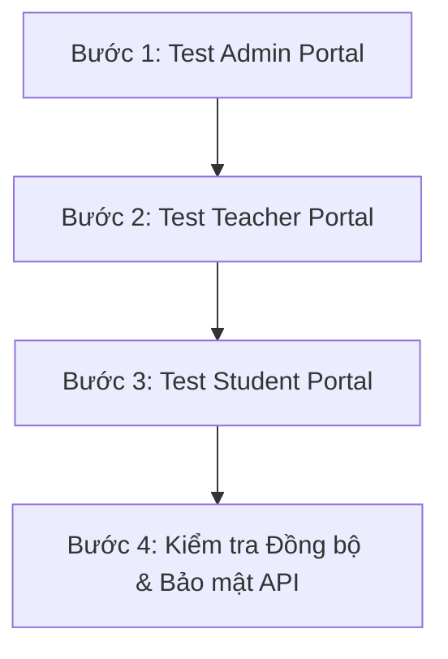

# TÀI LIỆU TỔNG HỢP TOÀN BỘ CHỨC NĂNG & KỊCH BẢN KIỂM THỬ HỆ THỐNG (LMS CLASSROOM)

> **Mục đích:** Tài liệu này thống nhất toàn bộ các đặc tả chức năng, quy định phân quyền (RBAC), logic nghiệp vụ, danh sách REST API và kịch bản kiểm thử (Test Checklist) của hệ thống Quản lý Lớp học (ClassRoom). Sử dụng làm căn cứ cho bước kiểm thử sản phẩm cuối cùng (Final Product Testing).

---

## I. TỔNG QUAN HỆ THỐNG & TÀI KHOẢN THỬ NGHIỆM

Hệ thống Quản lý Học tập (LMS ClassRoom) phân chia thành 3 vai trò chính. Dưới đây là các tài khoản thử nghiệm mặc định:

| Vai trò | Email đăng nhập | Mật khẩu | Đường dẫn chính | Phạm vi tác động |
| :--- | :--- | :--- | :--- | :--- |
| **Quản trị viên (Admin)** | `admin@gmail.com` | `admin123` | `/admin` | Toàn hệ thống (System-wide) |
| **Giáo viên (Teacher)** | `teacher@gmail.com` | `teacher123` | `/dashboard`, `/classrooms` | Lớp học được phân công (Class-scoped) |
| **Học sinh (Student)** | *(Tự đăng ký / Do GV cấp)* | *(Tùy chỉnh)* | `/dashboard`, `/classrooms` | Cá nhân trong lớp học (User-scoped) |

---

## II. MA TRẬN PHÂN QUYỀN HỆ THỐNG (RBAC MATRIX)

> **Ký hiệu:**  
> - `C` (Create): Tạo mới | `R` (Read): Xem / Tải về  
> - `U` (Update): Sửa / Cập nhật / Phân quyền | `D` (Delete): Xóa / Khóa / Vô hiệu hóa  

| Nhóm Chức Năng | Chi Tiết Nghiệp Vụ | Admin | Teacher | Student |
| :--- | :--- | :---: | :---: | :---: |
| **Xác thực & Tài khoản** | Đăng nhập / Đăng ký hệ thống | **R** | **C U R** | **C R** |
| | Cấp mới / Khóa / Mở khóa / Xóa tài khoản Giáo viên | **C U D** | - | - |
| | Cấp mới / Khóa / Mở khóa / Xóa tài khoản Học sinh | **C U D** | **C U D** | - |
| | Khôi phục (Reset) mật khẩu cho người dùng | **U** | **U** (Học sinh) | - |
| | Phân quyền Admin cho tài khoản khác | **U** | - | - |
| **Quản lý Lớp học** | Tạo lớp học mới (Tự động sinh mã `classCode` duy nhất) | - | **C** | - |
| | Xem danh sách lớp, sĩ số, giáo viên phụ trách | **R** | **R** | **R** (Chỉ lớp đã vào) |
| | Chỉnh sửa thông tin lớp / Xóa lớp học do mình phụ trách | - | **U D** | - |
| | Can thiệp quản trị: Khóa / Xóa lớp vi phạm quy định | **U D** | - | - |
| | Tham gia lớp học mới bằng mã `classCode` | - | - | **C** |
| **Tương tác & Bài học** | Đăng thông báo, chia sẻ tài liệu (PDF, Word, Video) | - | **C U D** | **R** |
| | Bình luận công khai (Comment) hỏi đáp trong lớp | - | **C R D** | **C R** |
| **Bài tập & Chấm điểm** | Giao bài tập về nhà, thiết lập Deadline & thang điểm | - | **C U D** | **R** |
| | Nộp bài tập (Đính kèm file PDF/Word / Nhập text) | - | - | **C U** |
| | Chấm điểm, chỉnh sửa điểm, gửi lời phê nhận xét | - | **C U D** | **R** (Chỉ xem điểm) |
| | Tự động tính Điểm trung bình môn (ĐTB) theo hệ số | - | **R** | **R** |
| **Điểm danh (Attendance)**| Tích chọn trạng thái (Có mặt / Đi muộn / Vắng mặt) | - | **C U** | - |
| | Thống kê tỷ lệ chuyên cần | - | **R** (Cả lớp) | **R** (Cá nhân) |
| **Trắc nghiệm (Quiz)** | Quản lý ngân hàng câu hỏi, tạo câu hỏi tự động bằng AI | - | **C U D** | - |
| | Làm bài thi trắc nghiệm trực tuyến (Đồng hồ đếm ngược) | - | - | **C** |
| | Tự động chấm điểm thi trắc nghiệm & đồng bộ Sổ điểm | - | **R** | **R** |
| **Báo cáo & Phân tích** | Biểu đồ phổ điểm, xu hướng chuyên cần, cảnh báo lỗ hổng AI | **R** (Hệ thống)| **R** (Lớp) | **R** (Cá nhân) |
| **Cài đặt & Bảo mật** | Bật/tắt bảo trì, cấu hình chung, múi giờ, logo | **C U** | - | - |

---

## III. CHI TIẾT CHỨC NĂNG & CHECKLIST KIỂM THỬ THEO PHÂN HỆ

---

### 1. PHÂN HỆ QUẢN TRỊ VIÊN (ADMIN PORTAL) - Đường dẫn: `/admin`

#### 1.1 Bảng điều khiển Quản trị (`/admin/dashboard` & `/admin/analytics`)
- [ ] **Thẻ Thống kê Tổng quan (4 Widgets):**
  - Hiển thị đúng số lượng Tổng Giáo viên, Tổng Học sinh, Lớp học đang hoạt động và Lượt tương tác.
  - Hiển thị phần trăm tăng trưởng (`%`) so với tháng trước.
- [ ] **Biểu đồ Tăng trưởng Người dùng (User Growth):** Hiển thị biểu đồ dạng cột (Bar Chart) thiết kế không viền, nổi bật mượt mà, so sánh chính xác lượng Giáo viên & Học sinh gia nhập hệ thống theo từng tháng.
- [ ] **Timeline Hoạt động Gần đây (Recent Activity):**
  - **Phân loại bằng Icon & Màu sắc Semantic:** Hiển thị icon riêng cho từng tác vụ chuyên môn của giáo viên (Icon Thêm Lớp - Xanh dương, Icon Bài Tập - Tím, Icon Điểm Danh - Xanh lá, Icon File/Tài liệu - Vàng, Icon Thông Báo - Đỏ).
  - **Thẻ Tên & Lớp học nổi bật:** In đậm Tên giáo viên + Highlight Tên môn/Lớp học giúp Admin đọc lướt 1 giây là hiểu ngay tác vụ.
  - **Nút Xem tất cả:** Thiết kế chuẩn `AnimatedAddButton` nằm ở chân thẻ với hiệu ứng hover mượt mà.
- [ ] **Biểu đồ Phân bổ Học sinh theo Giáo viên (Teacher Student Stats):**
  - Hiển thị danh sách các thẻ biểu đồ hình Tròn (Donut/Pie Chart) đại diện cho từng Giáo viên phụ trách môn học.
  - Hiển thị tổng số lượng Học sinh và tỷ lệ phân bổ Học sinh giữa các Lớp học do Giáo viên đó quản lý.
  - Tooltip tương tác hiển thị Tên lớp & Sĩ số khi di chuột; chân thẻ hiển thị nút tương tác "Đang quản lý X lớp học".

#### 1.2 Quản lý Người dùng (`/admin/users`)
- [ ] **Tạo tài khoản Giáo viên mới:**
  - Nút "Thêm giáo viên" mở Dialog điền Họ tên, Email, Mật khẩu khởi tạo.
  - Gọi API `POST /api/v1/auth/create-teacher` thành công.
- [ ] **Tìm kiếm & Lọc nâng cao:**
  - Ô tìm kiếm lọc chính xác theo Tên hoặc Email.
  - Lọc theo Vai trò (`Admin`, `Teacher`, `Student`).
  - Lọc theo Trạng thái (`Active` - Đang hoạt động, `Locked` - Đã khóa).
- [ ] **Khóa / Mở khóa tài khoản:**
  - Chuyển đổi trạng thái bằng API `PUT /api/v1/users/:id/status`.
  - **Kiểm thử bảo mật:** Khi tài khoản bị `Locked`, tài khoản đó lập tức bị chặn đăng nhập và xuất hiện thông báo lỗi phù hợp.
- [ ] **Phân quyền (Đổi quyền):**
  - Đổi quyền user bằng API `PUT /api/v1/users/:id/role`.
- [ ] **Reset Mật khẩu:**
  - Đặt lại mật khẩu mới cho người dùng qua API `PUT /api/v1/users/:id/reset-password`.
- [ ] **Xóa tài khoản:**
  - Xóa đơn lẻ hoặc xóa hàng loạt qua API `DELETE /api/v1/users/:id` có Dialog xác nhận cảnh báo.

#### 1.3 Quản lý Lớp học Hệ thống (`/admin/classrooms`)
- [ ] **Xem danh sách Lớp học Toàn hệ thống:**
  - Hiển thị thông tin: Tên lớp, Mã lớp, Giáo viên phụ trách, Bộ môn, Sĩ số, Ngày tạo, Trạng thái.
- [ ] **Quick View Panel (Xem nhanh chi tiết):**
  - Click vào 1 dòng lớp học -> Panel bên phải trượt ra hiển thị bài giảng hiện tại và timeline hoạt động gần đây của lớp đó (`GET /api/v1/classrooms/admin/:id/activities`).
- [ ] **Khóa / Mở khóa Lớp học:**
  - Khóa lớp qua API `PUT /api/v1/classrooms/:id/status`. Khi bị khóa, GV và HS trong lớp đó không thể truy cập làm bài tập.
- [ ] **Xóa Lớp học:**
  - Xóa vĩnh viễn lớp học qua API `DELETE /api/v1/classrooms/:id`.

#### 1.4 Cài đặt Hệ thống (`/admin/settings`)
- [ ] **Cấu hình Chung:** Thay đổi tên hệ thống, múi giờ (GMT+7), định dạng ngày tháng, logo.
- [ ] **Chế độ Bảo trì (Maintenance Mode):** Khi bật công tắc bảo trì, người dùng thông thường đăng nhập sẽ thấy màn hình thông báo bảo trì, chỉ duy nhất tài khoản Admin được phép truy cập.

#### 1.5 Ngân hàng Đề & Bài tập Hệ thống (`/bank`)
- [ ] **Quyền Quản trị viên (Admin):**
  - Có quyền truy cập `/bank` để soạn bài tập/đề thi mẫu dùng chung toàn trung tâm (`sharingStatus: 'CENTER_SHARED'`).
  - Có tính năng chọn Môn học (Toán, Ngữ Văn, Tiếng Anh, Vật lý, Hóa học, Sinh học,...) khi tạo đề trắc nghiệm hoặc bài tập.
  - Quản lý, xem chi tiết, chỉnh sửa và xóa tài nguyên học liệu trên toàn hệ thống.

---

### 2. PHÂN HỆ GIÁO VIÊN (TEACHER PORTAL) - Đường dẫn: `/classrooms`, `/bank`

#### 2.1 Quản lý Lớp học (`/classrooms`)
- [ ] **Danh sách Lớp học:** Hiển thị dạng Grid Card đẹp mắt. Mỗi thẻ hiển thị Tên lớp, Mã lớp (`classCode`), Sĩ số.
- [ ] **Tạo Lớp học Mới:** Nút `AnimatedAddButton` kích hoạt modal tạo lớp. Hệ thống tự động sinh `classCode` ngẫu nhiên duy nhất (ví dụ: `X8K9L2`).
- [ ] **Sao chép Mã lớp:** Nút click 1-touch copy nhanh mã lớp để gửi cho học sinh.

#### 2.2 Không gian Lớp học Chi tiết (`/classrooms/:id`)
- [ ] **Tab Bảng tin (Announcements):**
  - Giáo viên đăng bài thông báo mới, đính kèm file (PDF, Word) hoặc link Youtube/Drive.
  - Giáo viên và học sinh có thể gửi bình luận công khai bên dưới bài đăng.
- [ ] **Tab Bài tập (Assignments):**
  - **Tạo bài tập mới:** Nhập tiêu đề, mô tả, chọn hạn nộp (Deadline), chọn hệ số điểm. Nút "Giao bài ngay" dùng `AnimatedAddButton`.
  - **Chấm bài & Lời phê:** Mở danh sách bài nộp của học sinh, xem file đính kèm (PDF/Word), nhập điểm số và viết lời phê nhận xét. Nút "Lưu điểm" dùng `AnimatedAddButton`.
- [ ] **Tab Thành viên & Điểm danh (`/classrooms/:id/students` & `/attendance`):**
  - Thêm trực tiếp học sinh vào lớp hoặc mời học sinh ra khỏi lớp.
  - **Điểm danh hàng ngày:** Chọn ngày, tích chọn trạng thái từng HS (`Có mặt`, `Đi muộn`, `Vắng mặt`), nhập ghi chú lý do vắng. Nút "Lưu điểm danh" dùng `AnimatedAddButton`.
- [ ] **Tab Sổ điểm (`/gradebook`):**
  - Giao diện dạng bảng tính (Spreadsheet Grid).
  - Cho phép click trực tiếp vào ô để nhập/sửa điểm (Miệng, 15 phút, Giữa kỳ, Cuối kỳ).
  - Hệ thống tự động tính Điểm Trung Bình (ĐTB) theo công thức hệ số và xếp loại học sinh (Giỏi/Khá/TB/Yếu). Nút "Lưu sổ điểm" sử dụng `SaveButton`.

#### 2.4 Ngân hàng Câu hỏi & Tạo Đề Thi Trắc nghiệm (`/bank`)
- [ ] **Quản lý Câu hỏi:** Tạo câu hỏi trắc nghiệm (Nội dung, 4 đáp án A/B/C/D, chọn đáp án đúng, gắn tag chủ đề/lỗ hổng).
- [ ] **Tạo Câu hỏi Tự động bằng AI (Gemini):** Tải file Word (`.docx`) chứa bộ đề lên, AI tự động quét và bóc tách thành danh sách câu hỏi trắc nghiệm chuẩn.
- [ ] **Giao bài thi trắc nghiệm:** Thiết lập thời gian làm bài (ví dụ: 15 phút, 45 phút) và giao cho lớp học.

---

### 3. PHÂN HỆ HỌC SINH (STUDENT PORTAL) - Đường dẫn: `/dashboard`, `/classrooms`

#### 3.1 Trang chủ & Widget Phân tích Học tập Thông minh (`/dashboard`)
- [ ] **Card "Tiến độ hoàn thành bài tập" (`learningStats`):**
  - Hiển thị % bài tập đã hoàn thành của từng lớp học.
  - Thanh Tiến độ (Progress Bar) và con số thực tế `X/Y bài đã nộp`. Nút "Xem bài tập" dẫn đến `/assignments`.
- [ ] **Card "Cảnh báo Lỗ hổng Kiến thức" (`/analytics/student/weakness`):**
  - Hệ thống tự động phân tích lịch sử làm bài trắc nghiệm, nhóm theo tag câu hỏi và lọc ra **Top 5 dạng bài có tỷ lệ làm sai $\ge 40\%$**.
  - Nút **"Luyện tập ngay"** mở Dialog chọn số câu và chuyển hướng sang `/practice?tag=...` để ôn tập đúng điểm yếu.
- [ ] **Biểu đồ Cột "Tiến độ nộp bài 6 tháng" (`learningProgress`):**
  - Hiển thị so sánh giữa số bài đã nộp (Cột Xanh) và bài trễ/chưa nộp (Cột Cam) qua các tháng.
- [ ] **Widget "Mục tiêu tuần này" (`weeklyGoals`):**
  - Theo dõi mục tiêu chuyên cần 100% và chỉ tiêu nộp 5 bài tập/tuần.

#### 3.2 Tham gia Lớp học (Join Class)
- [ ] **Nhập mã `classCode`:** Học sinh nhập mã code do GV cung cấp -> Lớp học mới lập tức xuất hiện trong danh sách lớp của học sinh.

#### 3.3 Không gian Học tập & Nộp Bài tập (`/assignments` & `/assignments/:id`)
- [ ] **Xem danh sách Bài tập:** Phân loại bài tập Chưa hoàn thành (xếp theo hạn nộp gần nhất) và Đã hoàn thành (hiển thị Điểm & Lời phê).
- [ ] **Trang Chi tiết Bài tập & Nộp bài (`/assignments/:id`):**
  - Tải tài liệu môn học đính kèm (PDF/Word).
  - Đính kèm file bài làm của bản thân hoặc nhập ghi chú giải bài.
  - Nút nộp bài sử dụng **`<AnimatedSendButton>`** với hiệu ứng máy bay giấy biết bay khi rê chuột.
  - Khung **Thảo luận với Giáo viên**: Nhắn tin trao đổi hỏi đáp trực tiếp với giáo viên.

#### 3.4 Làm Bài thi Trắc nghiệm Online (`/exams/:id` & `/practice`)
- [ ] **Giao diện Thi Trắc nghiệm:**
  - Chế độ làm bài tập trung kèm Đồng hồ đếm ngược (Countdown Timer).
  - Tự động nộp bài và khóa chọn đáp án khi hết giờ.
  - Hiển thị ngay số câu đúng/sai, số điểm đạt được và lời giải chi tiết.

#### 3.5 Trợ lý Học tập AI Gemini (`/chat`)
- [ ] **Hỏi đáp với AI:** Gửi thắc mắc bài tập hoặc yêu cầu AI giải thích lại lý thuyết, tóm tắt bài học.

#### 3.6 Cơ chế Gamification & Điểm thưởng XP
- [ ] **Quy tắc Cộng/Trừ XP:**
  - **Từ điểm số bài tập/thi:** `XP = Điểm số × 3` (VD: 10 điểm = 30 XP).
  - **Thái độ nộp bài:** Nộp đúng hạn thưởng **+15 XP**, nộp trễ hạn **0 XP**.
  - **Điểm danh:** Có mặt **+5 XP**, Đi muộn **+2 XP**, Vắng mặt bị trừ **-5 XP**.
- [ ] **Công thức Cấp độ (Exponential Level Scaling):**
  - Level $N \rightarrow N+1$ cần $100 + (N - 1) \times 50$ XP.
- [ ] **Chuỗi nộp bài (Streak):** Đếm số bài nộp đúng hạn liên tiếp. Nếu nộp trễ 1 bài, chuỗi Streak bị reset về 0.
- [ ] **Bảng xếp hạng (Leaderboard):** Bảng xếp hạng XP tách biệt theo từng Lớp học. Trang chủ hỗ trợ Dropdown chọn lớp học để xem xếp hạng.

---

## IV. QUY TRÌNH HƯỚNG DẪN KIỂM THỬ SẢN PHẨM (END-TO-END TESTING WORKFLOW)

Vui lòng thực hiện kiểm thử theo 4 bước tuần tự dưới đây để đảm bảo toàn bộ luồng dữ liệu liên thông chính xác:

### 🔹 Bước 1: Kiểm thử Vai trò Quản trị viên (Admin)
1. Đăng nhập bằng `admin@gmail.com` / `admin123`.
2. Truy cập `/admin/users`: Tạo 1 Giáo viên mới -> Thử Khóa tài khoản -> Đăng xuất rồi thử dùng tài khoản đó đăng nhập (Xác nhận bị chặn) -> Mở khóa lại.
3. Truy cập `/admin/classrooms`: Xem danh sách lớp, mở Quick View Panel bên phải xem hoạt động.
4. Truy cập `/admin/settings`: Thử bật Chế độ bảo trì -> Kiểm tra xem user thường có bị chặn không -> Tắt bảo trì.

### 🔹 Bước 2: Kiểm thử Vai trò Giáo viên (Teacher)
1. Đăng nhập bằng `teacher@gmail.com` / `teacher123`.
2. Vào `/classrooms`: Tạo 1 lớp học mới (Lưu lại mã `classCode` vừa tạo).
3. Vào Chi tiết lớp học:
   - **Bảng tin:** Đăng 1 bài thông báo đính kèm file PDF.
   - **Bài tập:** Tạo 1 bài tập tự luận và 1 bài tập trắc nghiệm tính giờ 15 phút.
   - **Thành viên & Điểm danh:** Thực hiện điểm danh cho ngày hôm nay (`Có mặt` cho học sinh A, `Đi muộn` cho học sinh B).
4. Vào `/bank`: Thử tính năng tạo câu hỏi trắc nghiệm tự động bằng AI từ file Word (`.docx`).

### 🔹 Bước 3: Kiểm thử Vai trò Học sinh (Student)
1. Đăng nhập tài khoản Học sinh.
2. Tại Trang chủ/Lớp học: Nhập mã `classCode` (đã lấy ở Bước 2) để tham gia vào lớp.
3. Kiểm tra **Dashboard Analytics Widgets**:
   - Kiểm tra card "Tiến độ hoàn thành bài tập".
   - Nhấn "Luyện tập ngay" tại card "Cảnh báo Lỗ hổng kiến thức" để mở phòng ôn tập theo tag.
4. Vào Chi tiết lớp học:
   - Tải file tài liệu PDF từ Bảng tin và gửi 1 bình luận hỏi đáp.
   - Vào bài tập tự luận: Đính kèm file bài làm, gõ ghi chú và bấm nút **`<AnimatedSendButton>`** (kiểm tra hiệu ứng máy bay).
   - Vào bài thi trắc nghiệm: Kiểm tra đồng hồ đếm ngược, chọn đáp án và nộp bài (xem kết quả tức thì).
5. Kiểm tra **Bảng xếp hạng XP & Level**: Xác nhận điểm XP đã được cộng đúng công thức (Điểm × 3 + Thưởng đúng hạn + Chuyên cần).

### 🔹 Bước 4: Kiểm tra Chấm điểm & Đồng bộ (Giáo viên & Học sinh)
1. Chuyển sang tài khoản Giáo viên: Vào bài tập tự luận học sinh vừa nộp -> Nhập điểm 9.5 và gõ lời phê -> Bấm Lưu.
2. Vào trang `/gradebook` (Sổ điểm): Kiểm tra điểm tự động đồng bộ vào cột tương ứng và ĐTB môn được tính toán chính xác.
3. Chuyển sang tài khoản Học sinh: Kiểm tra thông báo điểm số và kiểm tra sổ điểm cá nhân.

---
*Tài liệu đã được nghiệm thu và sẵn sàng cho quá trình kiểm thử sản phẩm.*
