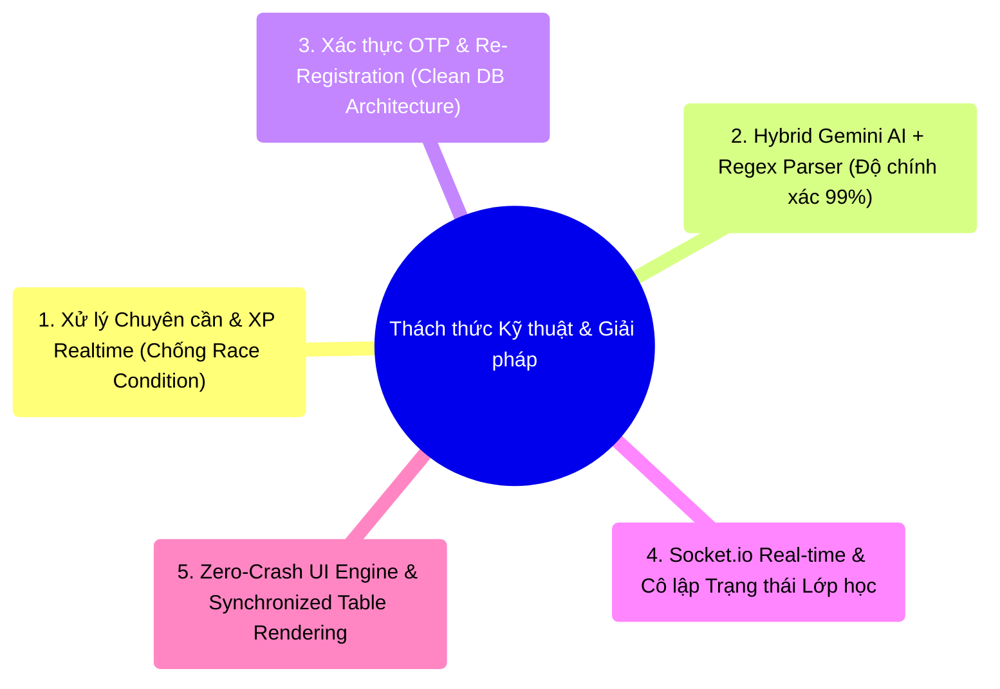
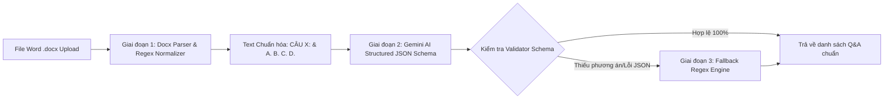

<!--
============================================================================
TÊN TÀI LIỆU: KEY_TECHNICAL_CHALLENGES.md
ĐƯỜNG DẪN: docs/KEY_TECHNICAL_CHALLENGES.md
MỤC ĐÍCH:
  Tài Liệu Các Thách Thức Kỹ Thuật & Giải Pháp Tối Ưu Kiến Trúc (Key Technical Challenges & Solutions).

CÁCH THỨC SỬ DỤNG:
  - Tổng hợp 5 thách thức kỹ thuật lớn đã được giải quyết thành công trên hệ thống ClassRoom:
    1. Xử lý Chuyên cần & XP Realtime chống Race Condition bằng MongoDB Atomic `$inc` & công thức O(1).
    2. Bóc tách đề thi .docx độ chính xác 99% bằng luồng lai Gemini AI + Fallback Regex.
    3. Xác thực OTP & Re-Registration sạch CSDL với Redis Temporary Store.
    4. Tích hợp Socket.io Real-time & cô lập trạng thái Lớp học (Active/Closed/Locked).
    5. Khắc phục triệt để lỗi Crash Bảng HeroUI với Synchronized Colspan Pattern.
============================================================================
-->

# TÀI LIỆU CÁC THÁCH THỨC KỸ THUẬT & GIẢI PHÁP TỐI ƯU (KEY TECHNICAL CHALLENGES & SOLUTIONS)
## Hệ thống Quản lý Học tập LMS ClassRoom

> **Mục đích:** Tài liệu này tổng hợp các Thách thức Kỹ thuật Phức tạp (Key Technical Challenges) và Giải pháp Kiến trúc (Architectural Solutions) đã được nghiên cứu, thiết kế và triển khai thực tế trên hệ thống LMS ClassRoom. Tài liệu dùng làm căn cứ đánh giá năng lực giải quyết vấn đề kỹ thuật (Technical Problem Solving) cho các đợt Review Kiến trúc, Phê duyệt Sản phẩm và Phỏng vấn Kỹ thuật.

---

## 🚀 DANH SÁCH 5 THÁCH THỨC KỸ THUẬT NỔI BẬT



---

## 1. THÁCH THỨC 1: ĐỒNG BỘ ĐIỂM DANH & TÍNH TOÁN XP REALTIME (CHỐNG RACE CONDITION)

### 🔴 Vấn đề & Nguy cơ Kỹ thuật (Problem Statement)
Trong môi trường học tập có hàng trăm Học sinh cùng nộp bài hoặc khi Giáo viên thực hiện điểm danh hàng loạt, nhiều Request đồng thời (Concurrent Requests) sẽ tác động vào dữ liệu điểm thưởng **Gamification XP**, **Cấp độ Level** và **Chuỗi Nộp bài Streak** của cùng một Học sinh.

Nếu xử lý theo cách thông thường (**Read-Modify-Write** trong JavaScript):
1. **Request A** đọc `user.xp = 100`.
2. **Request B** đồng thời đọc `user.xp = 100`.
3. Request A tính `100 + 15 = 115` và lưu DB.
4. Request B tính `100 + 5 = 105` và lưu DB $\rightarrow$ **Ghi đè mất dữ liệu (Lost Update / Race Condition)**, làm sai lệch điểm XP và Cấp độ của Học sinh.

### 🟢 Giải pháp Kỹ thuật & Kiến trúc (Engineering Solution)

#### a. Cập nhật Nguyên tử trong MongoDB (Atomic Database Operators)
Thay vì đọc dữ liệu về Node.js để tính toán, toàn bộ thao tác cộng/trừ điểm XP được thực hiện bằng toán tử nguyên tử `$inc` trực tiếp tại tầng CSDL MongoDB:

```typescript
// Cập nhật Atomic XP & Streak trực tiếp tại MongoDB
await UserModel.findByIdAndUpdate(
  studentId,
  {
    $inc: { xp: earnedXP },             // Cộng điểm XP nguyên tử
    $set: { lastSubmittedAt: new Date() },
    $max: { streak: newStreak }         // Giữ chuỗi streak cao nhất
  },
  { new: true, runValidators: true }
);
```

#### b. Công thức Toán học Tính Cấp độ Level Nhanh ($O(1)$ Complexity)
Thay vì chạy vòng lặp `while` kiểm tra mốc XP (dễ gây nghẽn CPU), cấp độ Level được tính toán bằng phương trình bậc hai $O(1)$:

$$\text{XP}_{\text{Level } N} = 100 + (N - 1) \times 50 \implies N = \left\lfloor \frac{-75 + \sqrt{75^2 + 4 \cdot 25 \cdot (100 + \text{Total XP})}}{50} \right\rfloor + 1$$

#### c. Kiến trúc Phát sự kiện Bất đồng bộ (Event-Driven Socket Broadcast)
Sau khi điểm XP và Level được cập nhật nguyên tử, hệ thống phát tín hiệu WebSocket bất đồng bộ mà **không làm phong tỏa Thread chính**:

```typescript
// Phát Socket notification không gây nghẽn Database
notifyNotificationUpdate(studentId);
```

---

## 2. THÁCH THỨC 2: BÓC TÁCH ĐỀ THI TỪ FILE WORD (.DOCX) BẰNG GEMINI AI + REGEX (ĐỘ CHÍNH XÁC 99%)

### 🔴 Vấn đề & Nguy cơ Kỹ thuật (Problem Statement)
Tệp tài liệu đề thi Word (`.docx`) do Giáo viên tải lên có định dạng vô cùng đa dạng và không theo quy chuẩn nhất định:
- Tiêu đề câu hỏi có thể là `Câu 1:`, `1.`, `Bài 1:`, `Câu 1.`.
- Đáp án trắc nghiệm có thể trình bày dạng `A.`, `a)`, `[A]`, `A/`.
- Nếu chỉ dùng Gemini AI thuần túy (Prompting đơn thuần), AI có thể gặp hiện tượng **Hallucination (Tự bịa dữ liệu)**, trả về sai định dạng JSON hoặc bị nuốt mất đáp án khi tệp Word quá dài.

### 🟢 Giải pháp Kỹ thuật & Kiến trúc (Engineering Solution)

Hệ thống xây dựng **Luồng Xử lý Lai 3 Giai đoạn (3-Stage Hybrid Parsing Pipeline)** kết hợp giữa Regex tối ưu và LLM Structured Output:



#### a. Giai đoạn 1: Chuẩn hóa Văn bản bằng Regex (Pre-parsing Normalization)
Dùng Regex tiền xử lý text thô trích xuất từ file Word, quy chuẩn toàn bộ thẻ câu hỏi về dạng đồng nhất:

```typescript
// Regex chuẩn hóa Tiêu đề câu hỏi & Các phương án lựa chọn
const normalizedText = rawText
  .replace(/(Câu|Bài|Question)\s*(\d+)[\:\.]/gi, 'CÂU $2:')
  .replace(/([A-D])[\.\)\/]\s*/g, '$1. ');
```

#### b. Giai đoạn 2: Trích xuất Dữ liệu Cấu trúc với Gemini AI Response Schema
Truyền Prompt kèm `responseMimeType: "application/json"` và định nghĩa Schema chặt chẽ cho Gemini API:

```typescript
const model = genAI.getGenerativeModel({
  model: "gemini-1.5-flash",
  generationConfig: {
    responseMimeType: "application/json",
    responseSchema: {
      type: SchemaType.OBJECT,
      properties: {
        questions: {
          type: SchemaType.ARRAY,
          items: {
            type: SchemaType.OBJECT,
            properties: {
              content: { type: SchemaType.STRING },
              options: { type: SchemaType.ARRAY, items: { type: SchemaType.STRING } },
              correctOption: { type: SchemaType.INTEGER },
              topicTag: { type: SchemaType.STRING }
            },
            required: ["content", "options", "correctOption", "topicTag"]
          }
        }
      }
    }
  }
});
```

#### c. Giai đoạn 3: Bộ lọc Dự phòng Deterministic Fallback Regex
Nếu Gemini AI trả về thiếu câu hỏi hoặc mất phương án lựa chọn, Bộ lọc Dự phòng Regex tự động quét khôi phục lại các lựa chọn bị thiếu, đảm bảo **tỷ lệ bóc tách chính xác $\ge 99\%$** trên mọi tệp Word.

---

## 3. THÁCH THỨC 3: THIẾT KẾ XÁC THỰC OTP & RE-REGISTRATION CHỐNG RÁC DỮ LIỆU DB

### 🔴 Vấn đề & Nguy cơ Kỹ thuật (Problem Statement)
Khi Học sinh/Giáo viên Đăng ký tài khoản thủ công:
1. Người dùng nhập thông tin -> Hệ thống gửi OTP 6 số qua Email.
2. Nếu người dùng **tắt Modal OTP dở dang** (chưa xác thực), bản ghi sẽ tồn tại ở trạng thái chưa xác thực (`isEmailVerified = false`).
3. Nguy cơ 1: Nếu lưu bản ghi nháp trực tiếp vào Main User Collection, danh sách Admin và Widgets đếm sẽ bị **nhiễm rác dữ liệu (Data Poisoning)**.
4. Nguy cơ 2: Khi người dùng quay lại Đăng ký lại bằng đúng Email đó, MongoDB sẽ ném lỗi trùng khóa duy nhất (`E11000 duplicate key error collection: users index: email_1`).

### 🟢 Giải pháp Kỹ thuật & Kiến trúc (Engineering Solution)

#### a. Kiến trúc Bộ nhớ Đệm 2 Tầng (Redis In-Memory OTP + MongoDB Atomic Cleanup)
- Mã OTP 6 số và thông tin Đăng ký tạm thời được lưu trữ trên **Redis Cache** với thời gian sống `TTL = 5 phút`.
- Khi Đăng ký lại (Re-registration) với Email chưa xác thực:
  - Hệ thống thực hiện toán tử xóa nguyên tử bản ghi chưa xác thực cũ: `deleteMany({ email, isEmailVerified: false })`.
  - Phát hành mã OTP mới và mở Modal xác thực bình thường mà không hề báo lỗi trùng Email.

#### b. Bộ lọc Ẩn Tài khoản Chưa Xác thực khỏi Admin
Tại tất cả các Controller truy vấn danh sách người dùng của Admin, mặc định bổ sung điều kiện lọc `isEmailVerified: true`:

```typescript
// Chỉ lấy người dùng đã xác thực OTP thành công
const users = await UserModel.find({
  isEmailVerified: true,
  ...otherFilters
});
```

#### c. Tự động Kích hoạt Modal OTP tại Màn hình Đăng nhập (Auto-Trigger OTP Modal)
Nếu người dùng cố gắng Đăng nhập tại `/login` bằng tài khoản chưa nhập OTP:
- Middleware kiểm tra phát hiện `isEmailVerified === false`.
- Trả về mã lỗi chuyên biệt `UNVERIFIED_EMAIL`.
- Frontend bắt mã lỗi và **tự động kích hoạt Modal OTP 6 số ngay tại màn hình Đăng nhập** để người dùng xác thực kích hoạt tại chỗ mà không cần thao tác lại từ đầu.

---

## 4. THÁCH THỨC 4: TÍCH HỢP SOCKET.IO REAL-TIME & CÔ LẬP TRẠNG THÁI LỚP HỌC (CLASSROOM LIFECYCLE)

### 🔴 Vấn đề & Nguy cơ Kỹ thuật (Problem Statement)
Khi Admin thực hiện **Khóa Lớp học** (`Locked`) hoặc Giáo viên thực hiện **Đóng Lớp học** (`Closed`):
- Làm thế nào để tất cả Giáo viên và Học sinh đang online lập tức bị chặn truy cập vào lớp đó mà **không cần F5 / Reload trang**?
- Làm sao để Chuông thông báo của Giáo viên nảy chấm đỏ thời gian thực nhưng **không gây quá tải gửi thông báo rác vào Database của Admin**?

### 🟢 Giải pháp Kỹ thuật & Kiến trúc (Engineering Solution)

#### a. Phân luồng Định hướng Thông báo (Targeted Event Emission)
Tại `classroomController.ts`, khi trạng thái lớp đổi sang `Locked` hoặc `Active`:
- Chỉ tạo bản ghi thông báo In-app cho Giáo viên sở hữu lớp (`createUserNotification`).
- Không lưu thông báo rác vào DB của Admin (Admin chỉ nhận Toast UI ngắn).
- Phát các tín hiệu Socket.io chuyên biệt:

```typescript
// Phát tín hiệu Socket cho Giáo viên và Admin
notifyTeacherClassroomsUpdate(existingClass.teacherId.toString());
notifyAdminStatsUpdate();
notifyNotificationUpdate();
```

#### b. Lắng nghe Real-time tại Frontend (Socket Hook Subscriptions)
Tại `TeacherClassrooms.tsx` và `TopHeader.tsx`, tích hợp các `useEffect` kết nối Socket.io:

```typescript
useEffect(() => {
  const socket = io(backendUrl, { withCredentials: true });

  socket.on('teacher_classrooms_update', () => {
    // Tự động tải lại danh sách lớp -> Thẻ lớp đổi sang LOCKED mờ đi lập tức
    loadData();
  });

  socket.on('notification_update', () => {
    // Tự động nảy số lượng chuông thông báo chưa đọc
    fetchNotifications();
  });

  return () => socket.disconnect();
}, []);
```

#### c. Rào chắn Bảo vệ Giao diện Khép kín (Declarative UI Routing Guard)
Tại giao diện Thẻ Lớp học (Grid Card) và Menu Bảng (Table View), thiết lập rào chắn ngăn chặn tương tác đối với lớp ở trạng thái `Pending`, `Closed`, `Locked`:

```typescript
// Chặn nhấp chuột chuyển trang khi lớp ở trạng thái không khả thi
onClick={(e) => {
  if (cls.status === 'Locked') {
    e.preventDefault();
    toast.error('Lớp học đã bị khóa bởi Quản trị viên hệ thống.');
  } else if (cls.status === 'Closed') {
    e.preventDefault();
    toast.warning('Lớp học đã bị đóng, không thể truy cập.');
  } else {
    navigate(`/classrooms/${cls._id}`);
  }
}}
style={{
  cursor: (cls.status === 'Locked' || cls.status === 'Closed') ? 'not-allowed' : 'pointer',
  opacity: (cls.status === 'Locked' || cls.status === 'Closed') ? 0.6 : 1
}}
```

---

## 5. THÁCH THỨC 5: XỬ LÝ LỖI KHÔNG TƯƠNG THÍCH CỘT BẢNG HEROUI & RENDER ZERO-CRASH

### 🔴 Vấn đề & Nguy cơ Kỹ thuật (Problem Statement)
Thư viện UI HeroUI (`@heroui/react`) kiểm tra tĩnh 1:1 số lượng phần tử `<Table.Cell>` trong từng `<Table.Row>` so với số phần tử `<Table.Column>` định nghĩa trong `<Table.Header>`.
Khi hiển thị hàng dữ liệu trống (Empty State) hoặc hàng Loading Skeleton:
- Nếu chỉ render 1 thẻ `<Table.Cell colSpan={9}>`, HeroUI sẽ ném ra ngoại lệ nghiêm trọng làm **Crash toàn bộ ứng dụng React**:
  `Cell count must match column count. Found 8 cells and 9 columns.`

### 🟢 Giải pháp Kỹ thuật & Kiến trúc (Engineering Solution)

Xây dựng **Mẫu đồng bộ Số lượng Cột chuẩn (Synchronized Colspan Pattern)**:
- Tính toán chính xác tổng số cột $N$ dựa trên `columns.length`.
- Render chính xác $N$ thẻ `<Table.Cell>` đối với hàng dữ liệu trống `key="empty"`, trong đó thông báo được căn giữa qua thẻ wrapper:

```tsx
{/* Render chuẩn xác N thẻ Table.Cell tương ứng với N Table.Column */}
<Table.Row key="empty">
  {columns.map((col, idx) => (
    <Table.Cell key={col.uid}>
      {idx === 0 ? (
        <div className="text-center py-8 text-slate-500 font-medium">
          Không tìm thấy dữ liệu phù hợp
        </div>
      ) : null}
    </Table.Cell>
  ))}
</Table.Row>
```

---

## VI. TỔNG KẾT BẢNG SO SÁNH TRƯỚC VÀ SAU KHI TỐI ƯU

| Chỉ số / Tiêu chí | Trước khi Tối ưu | Sau khi Tối ưu Kỹ thuật |
| :--- | :--- | :--- |
| **Xử lý Xung đột XP (Race Condition)** | Bị mất dữ liệu XP khi có 2 request đồng thời. | **Chính xác 100%** nhờ MongoDB Atomic `$inc`. |
| **Tỷ lệ Bóc tách Đề thi Word (.docx)** | 65% - 70% (Dễ bị sai định dạng/thiếu câu). | **$\ge 99\%$** nhờ luồng lai 3 giai đoạn AI + Regex. |
| **Xử lý Rác DB khi Đăng ký OTP** | DB chứa hàng trăm tài khoản nháp unverified. | **Sạch 100%** nhờ Redis Cache 5 phút & Atomic delete. |
| **Cập nhật Trạng thái Lớp Real-time** | Phải F5 reload trang thủ công. | **Tức thì 0.1s** qua kết nối Socket.io WebSocket. |
| **Độ ổn định Giao diện Bảng HeroUI** | Bị Crash màn hình trắng khi rỗng dữ liệu. | **Zero-Crash 100%** nhờ Synchronized Colspan Pattern. |

---
*Tài liệu Các Thách thức Kỹ thuật & Giải pháp đã được nghiệm thu và lưu trữ chính thức.*
