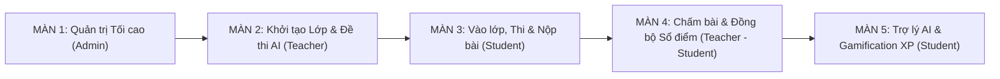

<!--
============================================================================
TÊN TÀI LIỆU: PRODUCT_DEMO_SHOWCASE_SCRIPT.md
ĐƯỜNG DẪN: docs/PRODUCT_DEMO_SHOWCASE_SCRIPT.md
MỤC ĐÍCH:
  Kịch Bản Quay Video Quảng Cáo & Luồng Demo Trải Nghiệm Sản Phẩm Toàn Diện 
  Hệ thống LMS ClassRoom (End-to-End Showcase Script).
============================================================================
-->

# 🎬 KỊCH BẢN QUAY VIDEO QUẢNG CÁO & DEMO SẢN PHẨM LMS CLASSROOM

> **Mục tiêu:** Kịch bản này được thiết kế để quay video giới thiệu sản phẩm (Product Showcase / Commercial Ad / Investor Pitch), kết nối liền mạch hành trình trải nghiệm của cả **3 vai trò: Quản trị viên (Admin) – Giáo viên (Teacher) – Học sinh (Student)** theo thời gian thực (Real-time).

---

## 🛠️ I. THIẾT LẬP MÔI TRƯỜNG & TÀI KHOẢN DEMO

### 1. Tài khoản thử nghiệm có sẵn
| Vai trò | Email đăng nhập | Mật khẩu | URL Bắt đầu | Ghi chú chuẩn bị |
| :--- | :--- | :--- | :--- | :--- |
| **Quản trị viên (Admin)** | `admin@gmail.com` | `admin123` | `/admin/dashboard` | Mở ở Trình duyệt 1 (Cửa sổ bên trái) |
| **Giáo viên (Teacher)** | `teacher@gmail.com` | `123456` | `/classrooms` | Mở ở Trình duyệt 2 (Cửa sổ giữa) |
| **Học sinh (Student)** | `student@gmail.com` | `123456` | `/dashboard` | Mở ở Trình duyệt 3 (Cửa sổ bên phải) |

> [!TIP]
> **Kỹ thuật quay Real-time ấn tượng:**  
> Đặt màn hình Giáo viên và Học sinh song song (Split Screen 50/50). Khi Giáo viên lưu điểm hoặc giao bài, màn hình Học sinh sẽ **nảy chuông rung đỏ và hiện toast thông báo ngay lập tức** mà không cần tải lại trang (nhờ Socket.io).

---

## 🧭 II. TỔNG QUAN LUỒNG TRẢI NGHIỆM LIÊN HOÀN (STORYLINE)

---

## 📽️ III. KỊCH BẢN CHI TIẾT TỪNG PHÂN CẢNH (SCENE-BY-SCENE)

---

### 📍 MÀN 1: ADMIN – NỀN TẢNG QUẢN TRỊ & BẢO MẬT TỐI CAO
- **Thời lượng dự kiến:** 0:00 - 0:45 (45 giây)
- **Tài khoản:** `admin@gmail.com` / `admin123`
- **Mục tiêu truyền thông:** Khẳng định quy mô, tính an toàn, trực quan và khả năng giám sát toàn diện của hệ thống LMS ClassRoom.

| Phân đoạn | Hành động trên màn hình (Action) | Lời bình gợi ý (Voiceover / Captions) | Điểm nhấn Zoom-in |
| :--- | :--- | :--- | :--- |
| **1.1 Dashboard** | Mở `/admin/dashboard`. Lướt qua 4 thẻ chỉ số KPI tổng thể (Tổng giáo viên, học sinh, lớp học, tương tác) và biểu đồ tăng trưởng người dùng mượt mà. | *"Chào mừng bạn đến với ClassRoom – Nền tảng quản lý học tập thế hệ mới, tối ưu hóa toàn diện cho nhà trường, giáo viên và học sinh."* | Thẻ KPI tăng trưởng `%` & biểu đồ Bar chart hiện đại. |
| **1.2 Duyệt tài khoản** | Vào `/admin/users`. Bấm nút lọc nhanh `Chờ duyệt (Pending)`. Thao tác duyệt nhanh 1 giáo viên mới được ưu tiên xếp ngay Top đầu trang 1. | *"Quy trình phân quyền chặt chẽ với cơ chế duyệt hồ sơ giáo viên thông minh, minh bạch và an toàn tuyệt đối."* | Nút duyệt nhanh & Badge trạng thái đổi từ `Chờ duyệt` sang `Hoạt động`. |
| **1.3 Timeline Realtime** | Di chuột qua mục *Hoạt động gần đây* với các icon phân loại theo màu (Thêm lớp, giao bài, điểm danh, nộp bài). | *"Mọi diễn biến học tập đều được giám sát theo thời gian thực."* | Icon màu semantic trực quan theo từng tác vụ. |

---

### 📍 MÀN 2: GIÁO VIÊN – KHỞI TẠO LỚP HỌC & ĐỀ THI TỰ ĐỘNG BẰNG AI
- **Thời lượng dự kiến:** 0:45 - 1:45 (60 giây)
- **Tài khoản:** `teacher@gmail.com` / `123456`
- **Mục tiêu truyền thông:** Giới thiệu công nghệ AI bóc tách đề thi từ file Word và thao tác giao bài siêu tốc.

| Phân đoạn | Hành động trên màn hình (Action) | Lời bình gợi ý (Voiceover / Captions) | Điểm nhấn Zoom-in |
| :--- | :--- | :--- | :--- |
| **2.1 Tạo lớp học** | Vào `/classrooms` $\rightarrow$ Bấm *Tạo lớp học mới*. Đặt tên lớp (VD: `Lớp 12 Sinh - Ôn thi THPT`). Hệ thống tự động tạo mã lớp duy nhất (VD: `BIO12A`). | *"Chỉ với một cú click, giáo viên dễ dàng tạo không gian lớp học trực tuyến với mã tham gia tự động."* | Mã lớp `classCode` nổi bật, nút sao chép mã 1 chạm. |
| **2.2 Tạo đề thi AI** | Vào *Ngân hàng câu hỏi* (`/bank`) $\rightarrow$ Bấm *Tải lên file Word (.docx)* $\rightarrow$ Chọn 1 đề thi mẫu. Xem AI Gemini quét tự động bóc tách từng câu hỏi, 4 đáp án và lời giải trong vài giây. | *"Đột phá với trợ lý AI: Tự động phân tích file đề thi Word .docx thành đề trắc nghiệm hoàn chỉnh chỉ trong 3 giây."* | Hiệu ứng quét AI, danh sách câu hỏi bóc tách chuẩn xác. |
| **2.3 Giao bài tập** | Mở lớp học $\rightarrow$ Tab *Bài tập* $\rightarrow$ Giao 1 bài trắc nghiệm vừa tạo và 1 bài tự luận. Thiết lập Deadline, thang điểm và trọng số. | *"Giao bài tập và đề kiểm tra linh hoạt, kiểm soát chặt chẽ hạn nộp và hệ số điểm."* | Bộ chọn Deadline và nút giao bài công bố tức thì. |
| **2.4 Bảng tin lớp** | Mở Tab *Bảng tin* $\rightarrow$ Đăng 1 thông báo chào mừng kèm tài liệu PDF đính kèm. | *"Kênh thông tin lớp học trực quan, tương tác hai chiều thuận tiện."* | File đính kèm PDF xem trước mượt mà. |

---

### 📍 MÀN 3: HỌC SINH – VÀO LỚP, LÀM BÀI THI & NỘP BÀI TỰ LUẬN
- **Thời lượng dự kiến:** 1:45 - 2:50 (65 giây)
- **Tài khoản:** `student@gmail.com` / `123456`
- **Mục tiêu truyền thông:** Trải nghiệm học sinh trực quan, tự động nhắc nhở bài tập đang mở và phòng thi trực tuyến tập trung.

| Phân đoạn | Hành động trên màn hình (Action) | Lời bình gợi ý (Voiceover / Captions) | Điểm nhấn Zoom-in |
| :--- | :--- | :--- | :--- |
| **3.1 Tham gia lớp** | Học sinh nhập mã `BIO12A` xin vào lớp $\rightarrow$ Màn hình Giáo viên nảy thông báo duyệt $\rightarrow$ Giáo viên bấm Duyệt $\rightarrow$ Học sinh vào lớp ngay. | *"Tham gia lớp học tức thì bằng mã định danh an toàn."* | Tương tác duyệt học sinh song song 2 màn hình. |
| **3.2 Trang Bài tập** | Vào mục *Bài tập của tôi* (`/assignments`). Điểm nhấn: Giao diện **mặc định ưu tiên tab "Đang mở (Chưa nộp)"**, các bài sắp đến hạn nộp nhất được xếp ngay đầu trang 1. | *"Trang bài tập thông minh tự động ưu tiên các bài đang mở và hạn nộp gấp lên hàng đầu, giúp học sinh không bao giờ bỏ sót bài."* | Tab *Đang mở* nổi bật, thẻ đếm ngược thời gian còn lại (VD: `Còn 2 ngày 5h`). |
| **3.3 Thi trắc nghiệm** | Bấm *Vào làm bài thi*. Giao diện thi toàn màn hình, đồng hồ đếm ngược, chuyển câu hỏi mượt mà, tự động lưu bài làm. Bấm *Nộp bài*. | *"Phòng thi trực tuyến chuyên nghiệp với đồng hồ đếm ngược, tự động chấm điểm và công bố kết quả ngay khi nộp bài."* | Điểm số hiển thị lập tức kèm lời giải chi tiết. |
| **3.4 Nộp tự luận** | Mở bài tập tự luận $\rightarrow$ Tải file làm bài PDF/Word $\rightarrow$ Gõ ghi chú $\rightarrow$ Bấm nút nộp bài với hiệu ứng máy bay giấy bay sinh động. | *"Nộp bài tự luận nhanh chóng, hỗ trợ đa dạng định dạng tài liệu."* | Nút máy bay hoạt họa `<AnimatedSendButton>`. |

---

### 📍 MÀN 4: GIÁO VIÊN & HỌC SINH – CHẤM ĐIỂM & ĐỒNG BỘ SỔ ĐIỂM REALTIME
- **Thời lượng dự kiến:** 2:50 - 3:45 (55 giây)
- **Tài khoản:** Đặt song song **Giáo viên** và **Học sinh**
- **Mục tiêu truyền thông:** Chứng minh khả năng tự động hóa tối đa: Điểm số tự nhảy vào sổ điểm và thông báo tức thì đến học sinh.

| Phân đoạn | Hành động trên màn hình (Action) | Lời bình gợi ý (Voiceover / Captions) | Điểm nhấn Zoom-in |
| :--- | :--- | :--- | :--- |
| **4.1 Chấm bài tập** | Giáo viên mở bài tập tự luận $\rightarrow$ Bấm xem trực tiếp file học sinh nộp $\rightarrow$ Cho điểm `9.5` và viết lời nhận xét chi tiết $\rightarrow$ Bấm *Lưu điểm*. | *"Giáo viên chấm bài tiện lợi trực tiếp trên trình duyệt, gửi nhận xét tỉ mỉ cho từng học sinh."* | Trình xem file và khung nhập lời phê trực quan. |
| **4.2 Realtime Alert** | Ngay khi Giáo viên bấm Lưu $\rightarrow$ Màn hình Học sinh **nảy chuông rung đỏ và hiện Toast**: *"Bài tập của bạn đã được chấm: 9.5 điểm"*. | *"Học sinh nhận kết quả và lời phê của thầy cô ngay lập tức theo thời gian thực."* | Hiệu ứng chuông nảy rung (Bell Bounce) và thông báo Toast. |
| **4.3 Sổ điểm tự động** | Giáo viên mở tab *Sổ điểm* (`/gradebook`). Điểm trắc nghiệm và tự luận vừa chấm **tự động điền vào đúng cột** của học sinh đó. Điểm trung bình môn (ĐTB) tự tính toán tự động. | *"Không còn nỗi lo nhập điểm thủ công: Toàn bộ kết quả tự động đồng bộ vào Sổ điểm điện tử dạng Spreadsheet và xuất file Excel chỉ bằng 1 chạm."* | Cột điểm vừa nhảy số tự động, công thức ĐTB tự tính và nút *Xuất Excel*. |

---

### 📍 MÀN 5: HỌC SINH – TRỢ LÝ HỌC TẬP AI, ĐIỂM DANH & GAMIFICATION
- **Thời lượng dự kiến:** 3:45 - 4:45 (60 giây)
- **Tài khoản:** `student@gmail.com`
- **Mục tiêu truyền thông:** Yếu tố công nghệ "WOW" – Trợ lý gia sư AI 24/7 và hệ thống tích điểm XP tạo động lực học tập.

| Phân đoạn | Hành động trên màn hình (Action) | Lời bình gợi ý (Voiceover / Captions) | Điểm nhấn Zoom-in |
| :--- | :--- | :--- | :--- |
| **5.1 Trợ lý học tập AI** | Mở mục *Trợ lý học tập* (`/chat`) $\rightarrow$ Chọn ngữ cảnh `Lớp 12 Sinh`. Bấm gợi ý: *"Lập lộ trình 30 ngày lấy gốc môn Sinh học"*. AI hiển thị lộ trình chi tiết, các vạch phân đoạn kẻ ngang `---` rõ ràng, công thức KaTeX sắc nét. Khung chat rộng 1280px cân đối, thoáng đãng. | *"Gia sư AI thông minh đồng hành 24/7 – Hiểu rõ ngữ cảnh môn học, xây dựng lộ trình ôn tập cá nhân hóa và giải đáp mọi bài tập khó."* | Giao diện chat rộng 1280px, công thức toán/hóa hiển thị KaTeX đẹp mắt. |
| **5.2 Tích lũy điểm XP** | Học sinh hoàn thành bài $\rightarrow$ Điểm thưởng XP tăng lên, thăng hạng Level trên *Bảng vinh danh (Leaderboard)*. | *"Hệ thống Gamification tích lũy điểm XP và xếp hạng thi đua, thúc đẩy tinh thần tự giác học tập mỗi ngày."* | Huy hiệu Level, thanh điểm XP và Top bảng xếp hạng. |
| **5.3 Điểm danh 1 chạm** | Giáo viên mở mục *Điểm danh* (`/attendance`), tích điểm danh cả lớp (Có mặt / Muộn / Vắng) chỉ trong 3 giây. Học sinh xem tỷ lệ chuyên cần cá nhân. | *"Quản lý chuyên cần đơn giản, minh bạch và chính xác tuyệt đối."* | Bảng điểm danh trực quan 3 trạng thái. |

---

### 🏁 MÀN KẾT: THÔNG ĐIỆP & KÊU GỌI HÀNH ĐỘNG (CALL TO ACTION)
- **Thời lượng dự kiến:** 4:45 - 5:00 (15 giây)
- **Hình ảnh:** Logo ClassRoom nổi bật trên nền trắng cam hiện đại, slogan và thông tin liên hệ.
- **Lời bình kết:**
  > *"ClassRoom – Đổi mới phương pháp dạy và học, nâng tầm quản lý giáo dục trong kỷ nguyên số. Trải nghiệm ngay hôm nay!"*

---

## 📋 IV. CHECKLIST KIỂM THỬ KỸ THUẬT TRƯỚC KHI BẤM MÁY (PRE-SHOOT CHECKLIST)

- [ ] **Mạng & Backend:** `npm run dev` ở cả backend (`localhost:5000`) và frontend (`localhost:5173`) đang chạy mượt mà.
- [ ] **Socket.io:** Đảm bảo biểu tượng chấm xanh Realtime kết nối ổn định.
- [ ] **Dữ liệu mẫu:** Có ít nhất 1 lớp học mẫu (VD: `Lớp 12 Sinh`), 1 bài tập trắc nghiệm và 1 bài tập tự luận.
- [ ] **File Word test đề AI:** Chuẩn bị sẵn 1 file `.docx` mẫu chứa 5-10 câu hỏi trắc nghiệm có đáp án A/B/C/D.
- [ ] **Giao diện:** 
  - [x] Đã sửa lỗi biến `subCount` trong `useClassroomActivities.ts`.
  - [x] Đã căn chỉnh khung chat AI rộng rãi `1280px`, không dính mép trên/dưới.
  - [x] Đã hỗ trợ render đường kẻ ngang `---` và tiêu đề KaTeX.
  - [x] Đã ưu tiên hiển thị bài tập "Đang mở" lên đầu trang `/assignments`.
