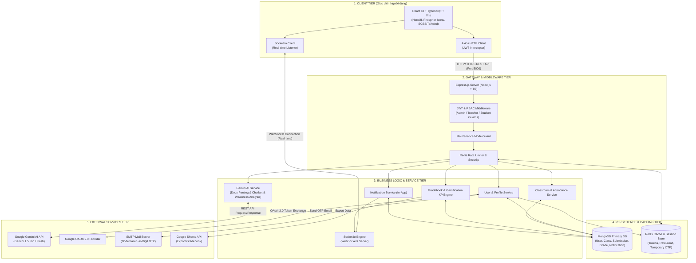
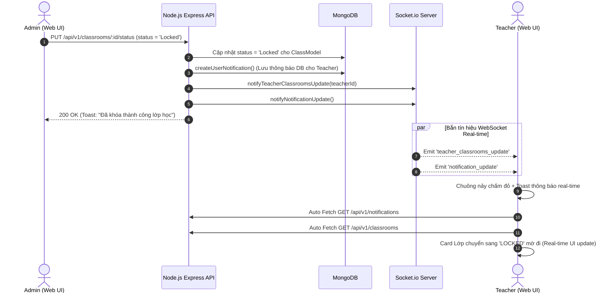
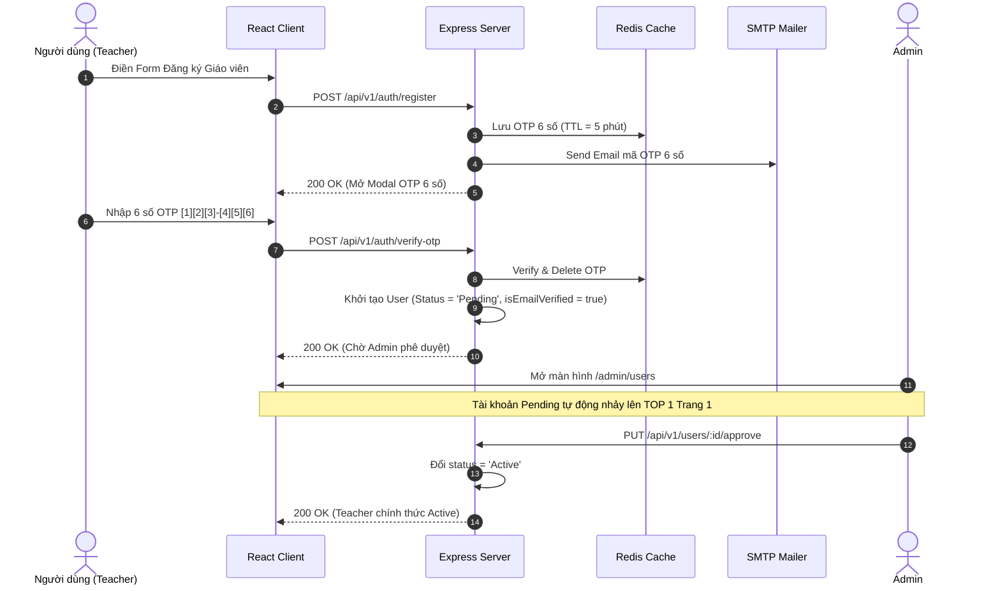
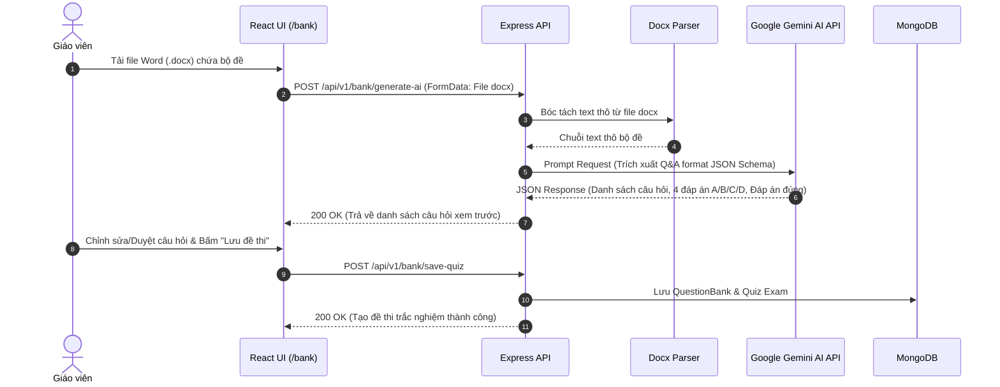
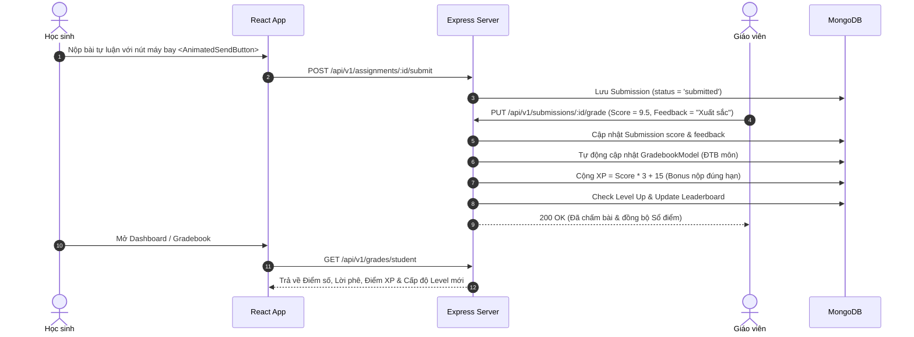

<!--
============================================================================
TÊN TÀI LIỆU: SYSTEM_ARCHITECTURE.md
ĐƯỜNG DẪN: docs/SYSTEM_ARCHITECTURE.md
MỤC ĐÍCH:
  Tài Liệu Sơ Đồ Kiến Trúc Hệ Thống (System Architecture Diagram & Data Flows).

CÁCH THỨC SỬ DỤNG:
  - Đặc tả mô hình phân tầng Client - Gateway - Service - Database - External Services (React, Node.js/Express, MongoDB, Redis, Google Gemini AI API, Socket.io Real-time).
  - Cung cấp Mermaid Sequence Diagrams giải thích chi tiết luồng xử lý: Duyệt/Khóa lớp Realtime, Đăng ký OTP 6 số, AI Gemini parse đề thi .docx, Chấm bài tích lũy XP Gamification.
============================================================================
-->

# TÀI LIỆU SƠ ĐỒ KIẾN TRÚC HỆ THỐNG (SYSTEM ARCHITECTURE DIAGRAM)
## Hệ thống Quản lý Học tập LMS ClassRoom

> **Mục đích:** Tài liệu này mô tả chi tiết toàn bộ kiến trúc tổng thể, mô hình phân tầng, luồng dữ liệu (Data Flow), sơ đồ chuỗi (Sequence Diagrams), cơ chế truyền nhận thời gian thực (Real-time Socket.io), và sự tương tác giữa Frontend (React), Backend Services (Node.js/Express), Database (MongoDB), Caching (Redis), và các Dịch vụ Nguồn ngoài (Google Gemini AI API, Google OAuth 2.0, SMTP OTP).

- 📌 **Tài liệu Sơ đồ Cơ sở Dữ liệu ERD**: [DATABASE_SCHEMA_ERD.md](file:///d:/HTML-CSS-JS/ClassRoom/docs/DATABASE_SCHEMA_ERD.md)

---

## I. TỔNG QUAN KIẾN TRÚC PHÂN TẦNG (HIGH-LEVEL TIERED ARCHITECTURE)

Hệ thống được thiết kế theo mô hình **Multitier Architecture (Mô hình nhiều tầng độc lập)** giúp đảm bảo tính mở rộng (Scalability), khả năng bảo mật (Security), và hiệu năng thời gian thực (Real-time Performance).

---

## II. CHI TIẾT CÁC PHẦN TỬ TRONG KIẾN TRÚC

### 1. Client Tier (Frontend - React 18 + Vite)
- **Công nghệ chính:** React 18, TypeScript, Vite, HeroUI (`@heroui/react`), Phosphor Icons, SCSS & TailwindCSS.
- **Quản lý State & Router:** React Router v6, Auth Context (`AuthContext.tsx`), Toast Context (`ToastContext.tsx`).
- **Thành phần giao diện nâng cao:**
  - Nút nộp bài tập có hiệu ứng máy bay giấy bay `<AnimatedSendButton>`.
  - Nút thêm mới animated `<AnimatedAddButton>`.
  - Bảng điểm dạng Spreadsheet `<ActivitiesTable>` & `<GradebookTable>`.
- **Truyền thông:**
  - **Axios HTTP Client:** Tự động đính kèm `Authorization: Bearer <token>` và xử lý làm mới Token/đăng xuất khi Token hết hạn.
  - **Socket.io Client (`socket.io-client`):** Lắng nghe các sự kiện thời gian thực từ Server (`notification_update`, `teacher_classrooms_update`, `admin_stats_update`).

### 2. Backend Gateway & Service Tier (Node.js / Express)
- **Công nghệ:** Node.js, Express Framework, TypeScript.
- **Tầng Middleware:**
  - `authMiddleware`: Giải mã JWT Token, trích xuất `userId` và `role`.
  - `roleMiddleware`: Phân quyền RBAC nghiêm ngặt (`UserRole.ADMIN`, `UserRole.TEACHER`, `UserRole.STUDENT`).
  - `maintenanceGuard`: Chặn truy cập của học sinh/giáo viên khi Admin bật Chế độ bảo trì hệ thống.
- **Tầng Service & Controllers:**
  - `classroomController.ts`: Xử lý CRUD lớp học, Đóng/Mở lớp (`Closed`/`Active`), Khóa/Mở khóa lớp (`Locked`), Lưu trữ (`Archived`).
  - `notificationService.ts`: Tạo thông báo In-app lưu DB và gọi Socket.io bắn sự kiện.
  - `googleSheetsService.ts`: Đồng bộ và xuất Sổ điểm ra Google Sheets.
  - `socket.ts`: Quản lý các kênh kết nối Socket.io toàn cục.

### 3. Engine Tương Tác AI & Xử lý Tài liệu (Google Gemini AI)
- **Dịch vụ AI:** Integration với **Google Gemini AI API** (`@google/generative-ai`).
- **Các nghiệp vụ AI cốt lõi:**
  1. **Bóc tách Bộ đề từ File Word (.docx):**
     - Đọc nội dung file Word bằng `mammoth`/`docx-parser`.
     - Gửi Prompt chuẩn hóa sang Gemini AI để trích xuất danh sách câu hỏi, 4 phương án A/B/C/D và đáp án đúng dưới dạng JSON Schema.
  2. **Trợ lý Học tập AI Chatbot (`/chat`):**
     - Giải đáp thắc mắc lý thuyết, hướng dẫn giải bài tập theo ngữ cảnh cho Học sinh.
  3. **Cảnh báo Lỗ hổng Kiến thức (`Weakness Analytics`):**
     - Phân tích lịch sử trắc nghiệm, nhóm theo tag chủ đề và tự động lọc ra top 5 dạng bài có tỷ lệ làm sai $\ge 40\%$.

### 4. Persistence & Caching Tier (MongoDB & Redis)
- **MongoDB Atlas / Local DB:**
  - Cơ sở dữ liệu NoSQL lưu trữ toàn bộ dữ liệu nghiệp vụ: `User`, `Class`, `ClassActivity`, `ClassJoinRequest`, `Submission`, `Grade`, `Notification`, `QuestionBank`.
- **Redis Cache & In-Memory Store:**
  - **Token Blacklist:** Lưu trữ các Token đã đăng xuất/vô hiệu hóa.
  - **OTP Temporary Store:** Lưu mã OTP 6 số xác thực Email kèm thời gian sống (TTL = 5 phút).
  - **Rate Limiting:** Chặn tấn công Spam/Brute-force trên các Route nhạy cảm.

---

## III. SƠ ĐỒ LUỒNG DỮ LIỆU CÁC NGHIỆP VỤ CHÍNH (DATA FLOW & SEQUENCE DIAGRAMS)

### 1. Luồng Duyệt / Khóa Lớp & Bắn Thông Báo Real-time (Admin <-> Teacher <-> Socket.io)

---

### 2. Luồng Đăng ký, Xác thực OTP 6 Số & Phê duyệt Giáo viên

---

### 3. Luồng Tạo Đề Thi Trắc Nghiệm Tự Động Bằng AI Gemini Từ File Word (.docx)

---

### 4. Luồng Chấm Bài, Tích Lũy Điểm XP & Đồng Bộ Sổ Điểm (Gradebook)

---

## IV. MA TRẬN CÔ LẬP TRẠNG THÁI LỚP HỌC (CLASSROOM STATE ISOLATION MATRIX)

Hệ thống quản lý chặt chẽ 4 trạng thái vòng đời Lớp học (Classroom Lifecycle States):

| Trạng thái Lớp | Giáo viên (Teacher) | Học sinh (Student) | Admin | Tín hiệu Socket.io |
| :--- | :--- | :--- | :--- | :--- |
| `Pending` (Chờ duyệt) | Chờ Admin duyệt. Thẻ đập đập ở TOP 1. **Chặn click** + Toast báo chờ. | Không nhìn thấy lớp. | Thấy nút 1-Click **[ Duyệt lớp ]** hoặc **[ Từ chối ]**. | Emit `admin_stats_update` |
| `Active` (Hoạt động) | Đầy đủ quyền quản trị lớp, đăng bài, tạo bài tập, chấm điểm. | Đầy đủ quyền xem bài học, nộp bài, làm thi online. | Giám sát, Quick View Panel. | Emit `teacher_classrooms_update` |
| `Closed` (Đã đóng) | Thẻ mờ đi (`opacity: 0.6`). **Chặn click**. Có nút **"Mở lại lớp"** trên Dashboard. | Thẻ mờ đi. **Chặn click** + Toast: *"Lớp học đã bị đóng..."*. | Xem danh sách lớp. | Emit `teacher_classrooms_update` |
| `Locked` (Bị khóa bởi Admin) | Thẻ mờ đi. **Chặn click** + Toast lỗi khóa. Nhận chuông thông báo Real-time. | Thẻ mờ đi. **Chặn click** + Toast lỗi khóa. | Có nút **[ Mở khóa lớp ]**. | Emit `teacher_classrooms_update` & `notification_update` |

---

## V. TỔNG KẾT & QUY CHUẨN KIỂM THỬ KIẾN TRÚC

1. **Tính độc lập nâng cao (High Cohesion, Low Coupling):** Sự tách biệt rõ ràng giữa Controller - Service - Data Layer giúp dễ dàng nâng cấp hoặc thay thế từng module (ví dụ chuyển từ MongoDB sang PostgreSQL hoặc từ Node.js sang Spring Boot mà không ảnh hưởng giao diện React).
2. **Khả năng phục hồi (Resilience & Real-time):** Socket.io tự động re-connect khi mất mạng; WebSocket fallback về HTTP Long-polling đảm bảo thông báo không bao giờ bị thất lạc.
3. **An toàn bảo mật (Defense in Depth):** Bảo mật đa tầng bao gồm Hashing Passwords bằng bcrypt, JWT Token mã hóa, OTP Redis 5 phút, RBAC middleware và Guards kiểm tra Chế độ Bảo trì.

---
*Tài liệu Kiến trúc Hệ thống đã được kiểm duyệt và thống nhất toàn bộ codebase.*
